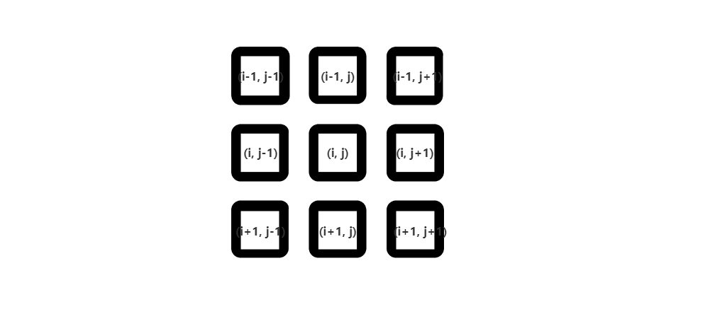
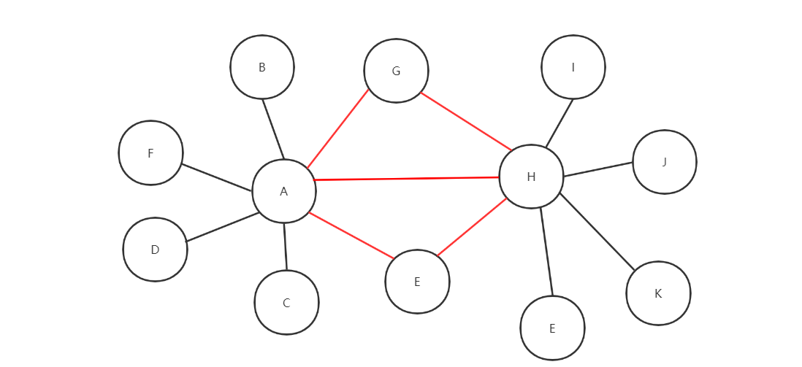
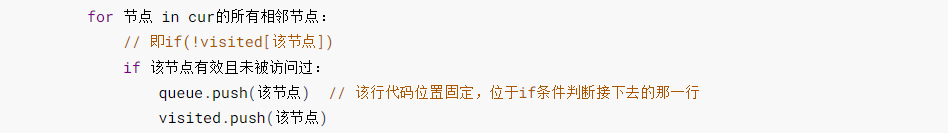

**无向图中两个顶点之间的`最短路径`的长度，可以通过广度优先遍历得到；**

BFS问题模板详见[Leetcode102-二叉树的层序遍历](./Leetcode102-二叉树的层序遍历.md)

<!-- more -->

做图类型的题目一般会使用到DFS和BFS两个算法

而在采用这两种算法思想之前最关键的一步就是**建图**，这能更好地对我们使用**BFS模板**进行结构性的引导。而关于建图有一种简易方法：**寻找相邻点**，这里的相邻点不仅仅是**显性相邻**的点，比如二维数组的上下左右点。还有可能是**隐形相邻**，或者说是**抽象**的相邻点，比如

1. **时钟里的时针，0刻度和1刻度就是相邻的点，而0刻度和11刻度也是相邻的点。从0刻度开始顺时针`走一步`就成了1刻度，逆时针`走一步`就成了11刻度**
2. **字母变化，英文一共有26个英文字母，每个字母都能通过`一次变化`从而变成其他25个英文字母，也就是说其他25个英文字母和该字母相邻**
3. 二维数组里一个节点的**九宫格**区域，每次通过改变数组下标来改变对应位置元素的值
4. ....

发现了什么规律没，我们在这里特别强调**变化一次等价于相邻**



***


***

**我们特别注意这里的红色线条，这里的交叉线条表示A能一次变成G,H,E；H也能一次变成A,G,E；G能一次变成A,H，E能一次变成A,H**，区别于比如B点一次只能变成A，J点一次只能变成H



只要有**逻辑上**的**变化一次**，我们就可以建议一幅图，等建立完一副图后就可以套BFS或者DFS的模板了

**需要注意的几点**

1. **图各个节点的元素会被题目的条件所限制，就比如说字母的变化，一个单词本来可以一次变成其他25个单词的，但是如果题目限定只能变成某几个字母，那么就按照题目给的限定条件来**

2. 建图有两种形式，一种是题目给你建好了图，即给了**边与点的关系**，这种情况下需要在对图进行**队列**操作之前通过循环等操作把所有的点与边连接起来。这时的建图方法可以使用**邻接表或者邻接矩阵**形式；或者就直接给你一个**二维数组**，这本身就直接给了你一个构造好了的邻接矩阵

   ```java
   // 比如给了4个点，3条边，然后连接成下图所示的图
   n = 4, edges = [[1, 0], [1, 2], [1, 3]]
   
           0
           |
           1
          / \
         2   3
   ```

   下面给出一个一般性的建图代码，使用**邻接矩阵**方式

   ```java
   /*建立图关系，在每个节点的list中存储相连节点*/
   List<List<Integer>> graph = new ArrayList<>();
   
   for (int i = 0; i < n; i++) {
     graph.add(new ArrayList<>());
   }
   
   for (int[] edge : edges) {
     graph.get(edge[0]).add(edge[1]);/*添加相邻节点*/
     graph.get(edge[1]).add(edge[0]);
   }
   
   // ==============================================
   
   /*循环条件当然是经典的不空判断*/
   while(!queue.isEmpty()){
     ....
     int cur = queue.poll();
     ....
     /*获取节点相邻节点集合*/
     List<Integer> neighbors = graph.get(cur);
     ....
   }
   ```

   **需要注意的是，这时的元素入队操作queue.push就没了构造节点这一目的了**

   **做题时如果有使用节点出入度的性质来辅助的话的模板**

   ```java
   /*建立图关系，在每个节点的list中存储相连节点*/
   List<List<Integer>> map = new ArrayList<>();
   
   for (int i = 0; i < n; i++) {
     map.add(new ArrayList<>());
   }
   
   /*建立各个节点的出度表*/
   int[] degree = new int[n];
   
   for (int[] edge : edges) {
     degree[edge[0]]++;
     degree[edge[1]]++;/*出度++*/
   
     map.get(edge[0]).add(edge[1]);/*添加相邻节点*/
     map.get(edge[1]).add(edge[0]);
   }
   
   /*建立队列*/
   Queue<Integer> queue = new LinkedList<>();
   /*把所有出度为1的节点，也就是叶子节点入队*/
   for (int i = 0; i < n; i++) {
     if (degree[i] == 1) queue.offer(i);
   }
   
   /*循环条件当然是经典的不空判断*/
   while(!queue.isEmpty()){
     ....
     int cur = queue.poll();
     ....
     /*获取节点相邻节点集合*/
     List<Integer> neighbors = map.get(cur);
     ....
   }
   ```

3. 另一种是一边在遍历题目所给元素，一边构造出来的，这个构造关键点就在**元素的入队queue.push(当前节点)**，详情参照[Leetcode102-二叉树的层序遍历](./Leetcode102-二叉树的层序遍历.md)



