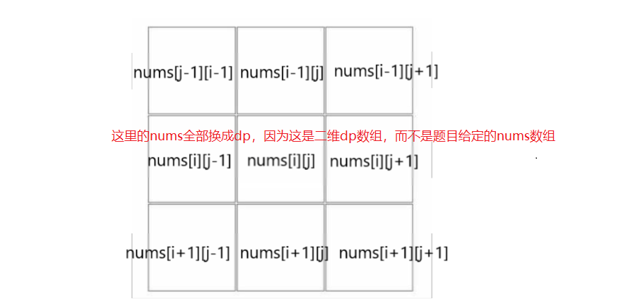
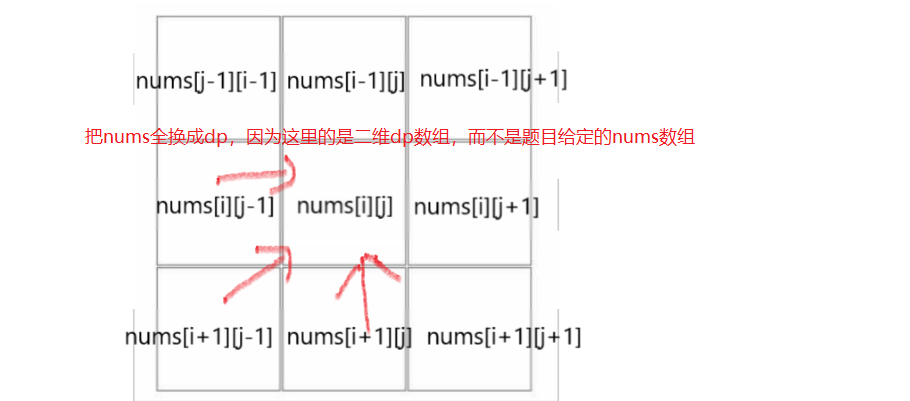
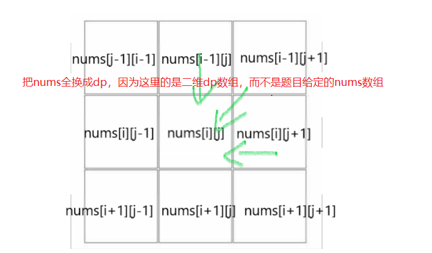

**转载自：[Leetcode题解（labuladong），略有增删](https://leetcode-cn.com/problems/best-time-to-buy-and-sell-stock/solution/yi-ge-fang-fa-tuan-mie-6-dao-gu-piao-wen-ti-by-l-3/)**

<!-- more -->

### 动态规划N步骤

1. 明确题目中的`状态`，以及该状态对应的含义dp数组含义；如何寻找状态？
   * 变化量(值会变化的)
   * 对立相反量(买入/卖出，左/右，做/不做....)，因为容易给dp数组定义下标：dp[0]，dp[1]。也就两个下标
   * **明确一点，状态即下标！状态即下标！状态即下标**，状态选择是什么，那么dp数组的下标需要以这个状态为标准进行设置。比如状态若为源数组的下标，那么dp数组的下标就为dp[1,2,3,4,5.....]；如果状态为对立相反的量，那么dp数组的下标就只有dp[0]和dp[1]
   
2. 根据状态明确`最小子问题`，简而言之就是`寻找最容易想到的值`，**而且如果有`无限多个`最小子问题时，必须是一个和状态量无关的定值，即不管状态量为什么，最小子问题的值始终固定**
   * 比如求数组里的最长子序列：每个元素本身就是一个子序列，如果用**dp[i] [j]** 代表数组从i到j的最长子序列，则**dp[i] [i] = 1**，这个问题存在着多个最小子问题，但是dp[i] [i]的值始终为1，所以这个最小子问题值是符合条件的
   * 再比如[打家劫舍问题](https://leetcode-cn.com/problems/house-robber/)：如果把**dp[i]** 定义成前**i**间最大偷取钱数，则**dp[0]** 表示前0间最大偷取的钱，可不就是0吗；则**dp[1]** 表示前1间最大偷取的钱，可不就是nums[0]吗
   * 。。。。

3. 列出状态转移方程，**一定，一定，一定会用到多次循环，这是针对状态进行的循环，有多少个状态就有多少层嵌套循环(比如针对状态i从0循环到n，针对状态j从i+1循环到n，针对状态k从n循环到0......，每层循环的次数根据该状态有几种不同的值来决定，其中类似于对立相反的状态一般只需要写两行代码就好了dp[i] [0] = ?和dp[i] [1] = ?，不需要循环，有超出2个以上的状态值的话使用循环，但是具体问题还是要具体分析)** ：**这一步是最困难的，可能涉及到多次if条件判断, 循环等等，请耐心读题；但是如果状态设置的好，那么转移方程也好列出**。

   * 还需要注意一点的是一定是某几个`点`概念的值进行判断比较，比如对于时间比较而言，我要比较的是`时刻`这个点概念值的大小，而不是比较时间这个`范围`概念的值的大小；比如dp数组的意义若为`前i`个数组值怎么怎么样，那么在进行状态转移的时候比较的永远是**给定数组**的`第i`个数组值进行比较。类似于nums是给定数组，然后状态转移判断时采用`if(nums[i - 1] >= nums[i])`，**进行`if条件判断`的是题目给定数组，而方程转移的是dp数组**。

     ```c++
     // 比的是点，变的是线(一维dp数组)或者面(二维dp数组)或者三,四维dp数组.....
     if(nums[i - 1] >= nums[i]){
       dp[i] = dp[i - 1] + 1;
     }
     ```

   * 且一般都是从下标`i - 2, i - 1, i, i + 1, j - 2, j - 1, j , j + 1,j + 2.....`等下标入手，**你要想想dp[i] [j]要怎么和上述的几个下标元素内容发生关系**。但这也不是完全契合部分题目，下标的选择还是要看状态如何设置，毕竟**状态即下标**，比如背包问题中，其中一个状态为背包容量，那么`dp数组下标`就是背包容量，下标的变化也就成了`dp[i-1][j-nums[i]]`



* **第三步的时候一定要注意一点**：`必须用已知推未知, 不能用未知推已知`

  * 如果已知左下三个元素的值，就**只能**通过左下三个值推nums[i] [j]

  

  * 如果已知右上三个元素的值，就**只能**通过右上三个值推nums[i] [j]，



4. 明确最终状态并且返回。如果说第二步是明确其中一个极端的话(什么都不做)，那么这步就是明确另一个极端(做完了)。对应在下标的表示上
   * 比如初始状态是dp[0]的话，那么最终状态就是dp[n]
   * 比如初始状态是dp[0] [0]的话，那么最终状态就是dp[n] [m]
   * .....

### 给自己定个小目标：每做一道动态规划题都先用使用公式，把每道题的条件填入公式里

公式：

1. 状态：A ，B，C....，N个状态的组合对应着什么值
2. 最小状态：dp[i] = ... 或者 dp[i] [0] = .....或者其他
3. 状态转移方程(通过对状态的循环多次，有几个状态就有几层循环，对立相反的状态只需写两行代码即可，不需要循环)：dp[i] = dp[i - 1] + 1或者其他
4. 返回最终状态：return dp[n]；或者其他

### 那么回到本道题

1. 状态：天数(可变值)，持有股票与否(对立的一对值)，这两个状态对应的含义为第i天时，是否持有股票，然后前i天**最多**赚了多少钱
2. 最小状态：
   * dp[1] [0] = 0：第1天，没持有股票，一分钱没赚找
   * dp[1] [1] = 0 - prices[i]：第1天，持有股票，因为买了第一天的股票，所以亏了prices[i]那么多的钱

3. 状态转移方程(**该题有两个状态，其中一个是对立相反的状态，所以只需要一层循环+每层循环两行代码即可**)：
   * **dp[i] [0] = max(dp[i - 1] [0]，dp[i - 1] [1] + prices[i - 1])** ：第i天没有持有股票要么就是昨天没持有，今天也没持有；要么就是昨天买入股票持有，但是今天卖了(**注：这里的prices[i - 1]表示第i天的价格，dp[i] [0]表示前i天，比如前1天就表示prices[0]，注意两者的区别与联系**)
   * **dp[i] [1] = max(dp[i - 1] [1]，dp[i - 1] [0] - prices[i - 1])** ：第i天持有股票要么就是昨天也持有，今天也持有；要么就是昨天没持有，但是今天买入股票变成持有了

4. 返回最终状态：return dp[n] [0]；意味第n天没持有股票，然后然后前n天**最多**赚了多少钱

```c++
class Solution {
  public:
    int maxProfit(vector<int> &prices) {
        int n = prices.size();
        vector<vector<int>> dp(n + 1, vector<int>(2, 0));
        if(n == 0){
          	return 0;
        }
        dp[1][0] = 0;
        dp[1][1] = 0 - prices[0];
      	for (int i = 2; i <= n; i++) {
          	dp[i][0] = max(dp[i - 1][0], dp[i - 1][1] + prices[i - 1]);
           	// 这里是0 - prices[i - 1]，而不是dp[i - 1][0] - prices[i]的原因是只进行一次交易
        		// 如果状态是dp[i][1]的话，则表示之前就没有买入过股票，而只能进行一次交易，所以就是0 - prices[i - 1]
        		dp[i][1] = max(dp[i - 1][1], 0 - prices[i - 1]);
      	}
      	return dp[n][0];
    }
};
```

## 2. Leetcode123. 买卖股票的最佳时机 III

这道题又多了一个状态：最大交易次数；让我们复习一下，多了一个状态意味着多了一个状态下标，意味着多了一层状态循环。我们暂且把这个状态的下标定为k

1. 状态转移方程没有可以简化的地方，就是在原有的基础上加上k这个元素下标

   dp[i] [k] [0] = max(dp[i - 1] [k] [0]，dp[i - 1] [k] [1] + prices[i - 1])

   dp[i] [k] [1] = max(dp[i - 1] [k] [1]，dp[i - 1] [k - 1] [0] - prices[i - 1])

2. 最小状态
   * 当k==1时，也就是前面一题的情况，dp[1] [1] [0] = 0，dp[1] [1] [1] = 0 - prices[0]
   * 当k==2时，其实仔细想一想也就是和k==1同一个初始条件，我就一天你还能交易两次？

```java
class Solution {
    public int maxProfit(int[] prices) {
        int max_k = 2, n = prices.length;
        if(n == 0){
            return 0;
        }
        int [][][] dp = new int[n + 1][max_k + 1][2];
        for(int k = max_k; k >= 1; k--){
            dp[1][k][0] = 0;
            dp[1][k][1] = -prices[0];
        }
        for(int i = 2; i <= n; i++){
            for(int k = max_k; k >= 1; k--){
                dp[i][k][0] = Math.max(dp[i - 1][k][0], dp[i - 1][k][1] + prices[i - 1]);
                dp[i][k][1] = Math.max(dp[i - 1][k][1], dp[i - 1][k - 1][0] - prices[i - 1]);
            }
        }
        return dp[n][max_k][0];
    }
}
```

## 3. Leetcode122. 买卖股票的最佳时机 II

* 状态转移方程没有可以简化的地方，就是在原有的基础上加上k这个元素下标

  ​	dp[i] [k] [0] = max(dp[i - 1] [k] [0]，dp[i - 1] [k] [1] + prices[i - 1])

  ​	dp[i] [k] [1] = max(dp[i - 1] [k] [1]，dp[i - 1] [k - 1] [0] - prices[i - 1])

* 只不过k为无穷大，那么就可以认为 k 和 k - 1 是一样的，跟k == 1时的情况一模一样，代码也是一模一样

  ​	dp[i] [0] = max(dp[i - 1] [0], dp[i - 1] [1] + prices[i - 1]);

  ​	dp[i] [1] = max(dp[i - 1] [1], dp[i - 1] [0] - prices[i  - 1]);

```c++
class Solution {
public:
  int maxProfit(vector<int> &prices) {
        int n = prices.size();
        vector<vector<int>> dp(n + 1, vector<int>(2, 0));
        if(n == 0){
            return 0;
        }
        dp[1][0] = 0;
        dp[1][1] = -prices[0];
        for (int i = 2; i <= n; i++) {
            dp[i][0] = max(dp[i - 1][0], dp[i - 1][1] + prices[i - 1]);
          	// 跟k==1时的情况一模一样
          	// 除了因为没有次数限制，从0 - prices[i - 1]变为了dp[i - 1][0] -prices[i - 1]之外
            dp[i][1] = max(dp[i - 1][1], dp[i - 1][0] -prices[i - 1]);
        }
        return dp[n][0];
    }
};
```

## 4. Leetcode714. 买卖股票的最佳时机含手续费

换汤不换药，就是在卖出股票的时候再花费一笔手续费

```c++
class Solution {
public:
  int maxProfit(vector<int> &prices, int fee) {
    int n = prices.size();
    vector<vector<int>> dp(n + 1, vector<int>(2, 0));
    if(n == 0){
      return 0;
    }
    dp[1][0] = 0;
    dp[1][1] = -prices[0] - fee;
    for (int i = 2; i < n; i++) {
      dp[i][0] = max(dp[i - 1][0], dp[i - 1][1] + prices[i - 1]);
      dp[i][1] = max(dp[i - 1][1], dp[i - 1][0] - prices[i - 1] - fee);
    }
    return dp[n][0];
  }
};
```

## 5. Leetcode309. 最佳买卖股票时机含冷冻期

就是类似于打家劫舍问题里的隔一天再买，涉及到`i - 2`

```c++
class Solution {
public:
  int maxProfit(vector<int> &prices) {
    int n = prices.size();
    vector<vector<int>> dp(n + 1, vector<int>(2, 0));
    if(n == 0){
      return 0;
    }
    dp[1][0] = 0;
    dp[1][1] = -prices[0];
    if(n >= 2){
        dp[2][0] = max(prices[1] - prices[0], 0);
        dp[2][1] = max(-prices[0], -prices[1]);
    }
    for (int i = 3; i <= n; i++) {
      dp[i][0] = max(dp[i - 1][0], dp[i - 1][1] + prices[i - 1]);
      dp[i][1] = max(dp[i - 1][1], dp[i - 2][0] - prices[i - 1]);
    }
    return dp[n][0];
  }
};
```

