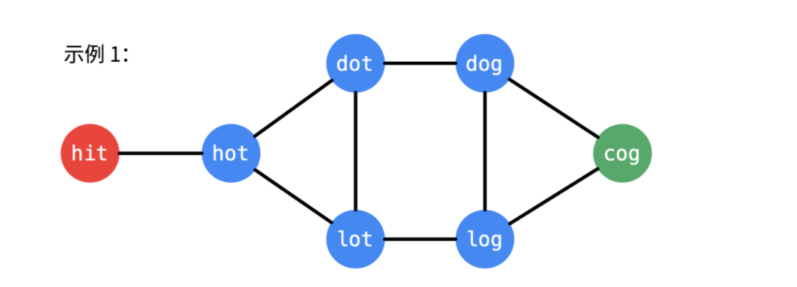

建图方法详见和BFS问题模板详见[BFS问题模板](./BFS问题模板.md)

**转载自：[Leetcode题解（liweiwei1419），略有增删](https://leetcode-cn.com/problems/word-ladder/solution/yan-du-you-xian-bian-li-shuang-xiang-yan-du-you-2/)**

<!-- more -->

1. 通过建图模板里对题目的分析，我们观察到题目里的**转换**刚好就契合建图模板里的**改变一次**说法，所以可以通过模板建图，找到只变化一次的情况然后连接。只不过模板里说的是字母之间的转换，而本道题是单词之间的转换，但本质相同

   **注：比如说从`hit`到`hot`只是中间的那个单词变化了`一次`，从`log`到`cog`只是第一个单词变化了`一次`**



2. 我们在遍历一开始，把所有的单词列表放进一个哈希表中，然后在遍历的时候构建图，每一次得到在单词列表里可以转换的单词，**并把它推入队中**
3. 这里说明一下在BFS模板里强调的**要确定当前遍历到了哪一层**具体是什么意思：比如`lot`这个单词是从`hit`变化了两次才形成的，而`dot`也是由`hit`变化了两次形成的，所以`lot`和`dot`是位于同一层，也可以表示为**走了两步**。那为什么要强调同一层呢？因为**同一层的节点是不能再相互遍历的**，比如从`lot`到`cog`需要变化两次，而如果`lot`先遍历同层元素，比如`dot`，那么最小需要从lot——>dot——>dog——>cog，即三次才能访问到。这比刚才的次数要多，不符合题意，所以不能访问同一层元素。

**模板化书写，根据公式分析，公式里没提及的全是固定套路代码**

1. 循环因子：一个单词有（wordLen * 26）个相邻节点，因为可以**一次**变成（wordLen * 26）个其他单词，所以循环因子有两个，因此有两层嵌套循环

   ```java
   for (int j = 0; j < wordLen; j++) {
     for (char k = 'a'; k <= 'z'; k++) {
     }
   }
   ```

2. 构造相邻节点：因为队列里元素为字符串，所以要构造新字符串

   ```java
   charArray[j] = k;
   String nextWord = String.valueOf(charArray);
   ```

**完整代码**

```java
class Solution {
    public int ladderLength(String beginWord, String endWord, List<String> wordList) {
        // 先将 wordList 放到哈希表里，便于判断某个单词是否在 wordList 里
        Set<String> wordSet = new HashSet<>(wordList);
        if (wordSet.size() == 0 || !wordSet.contains(endWord)) {
            return 0;
        }
        wordSet.remove(beginWord);

        // 图的广度优先遍历，必须使用的队列和表示是否访问过的 visited （数组，哈希表）
        Queue<String> queue = new LinkedList<>();
        queue.offer(beginWord);

        Set<String> visited = new HashSet<>();
        visited.add(beginWord);

        int wordLen = beginWord.length();
        // 包含起点，因此初始化的时候步数为 1
        int step = 1;
        while (!queue.isEmpty()) {

            int currentSize = queue.size();
            for (int i = 0; i < currentSize; i++) {
                // 依次遍历当前队列中的单词
                String word = queue.poll();
                char[] charArray = word.toCharArray();

                if(word.equals(endWord)){
                    return step;
                }

                // 修改每一个字符
                for (int j = 0; j < wordLen; j++) {
                    // 一轮以后应该重置，否则结果不正确
                    char originChar = charArray[j];

                    for (char k = 'a'; k <= 'z'; k++) {
                        if (k == originChar) {
                            continue;
                        }

                        charArray[j] = k;
                        String nextWord = String.valueOf(charArray);

                        if (wordSet.contains(nextWord) && !visited.contains(nextWord)) {
                            queue.add(nextWord);
                            // 注意：添加到队列以后，必须马上标记为已经访问
                            visited.add(nextWord);
                        }
                    }
                    // 恢复
                    charArray[j] = originChar;
                }
            }
            step++;
        }
        return 0;
    }
}
```

