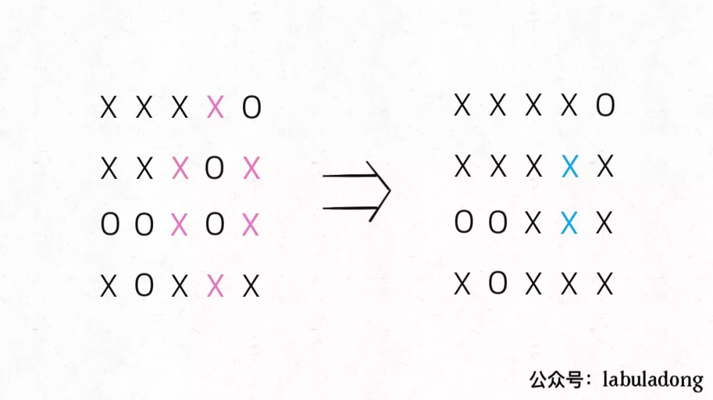
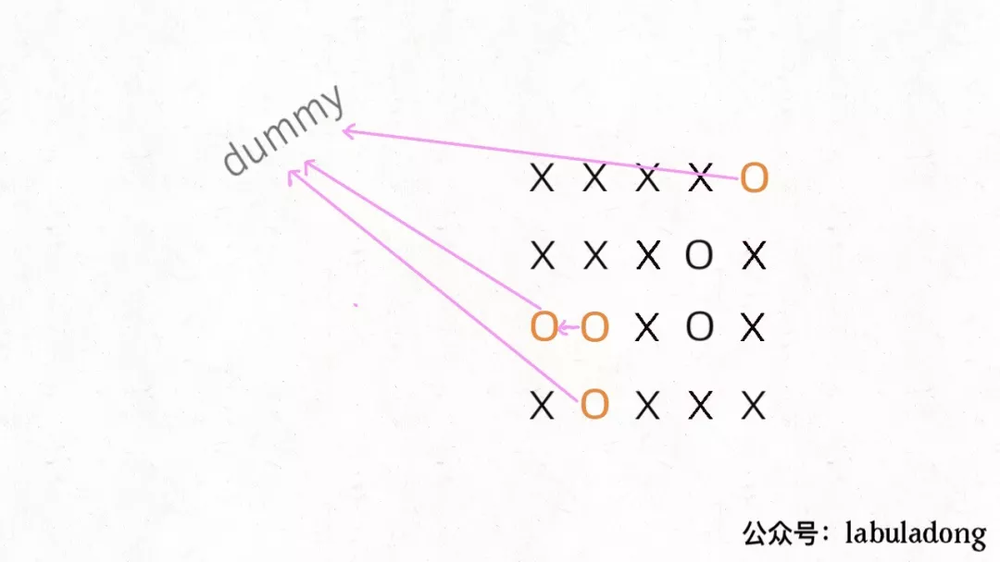

**转载自：[公众号（labuladong），略有增删](https://mp.weixin.qq.com/s/K_oV5JWYpBo9cWTHz6e35Q)**

<!-- more -->

注意哦，必须是完全被围的`O`才能被换成`X`，也就是说边角上的`O`一定不会被围，进一步，与边角上的`O`相连的`O`也不会被`X`围四面，也不会被替换：



这个问题本身使用DFS解决的，也可以用 Union-Find 算法解决，虽然实现复杂一些，甚至效率也略低，但这是使用 Union-Find 算法的通用思想，值得一学。

**你可以把那些不需要被替换的O看成一个拥有独门绝技的门派，它们有一个共同祖师爷叫dummy，这些O和dummy互相连通，而那些需要被替换的O与dummy不连通**。

这就是 Union-Find 的核心思路，明白这个图，就很容易看懂代码了：



首先要解决的是，根据我们的实现，Union-Find 底层用的是一维数组，构造函数需要传入这个数组的大小，而题目给的是一个二维棋盘。

这个很简单，二维坐标`(x,y)`可以转换成`x * n + y`这个数（`m`是棋盘的行数，`n`是棋盘的列数）。敲黑板，**这是将二维坐标映射到一维的常用技巧**。

其次，我们之前描述的「祖师爷」是虚构的，需要给他老人家留个位置。索引`[0.. m*n-1]`都是棋盘内坐标的一维映射，那就让这个虚拟的`dummy`节点占据索引`m*n`好了。

```java
void solve(char[][] board) {
    if (board.length == 0) return;

    int m = board.length;
    int n = board[0].length;
    // 给 dummy 留一个额外位置
    UF uf = new UF(m * n + 1);
    int dummy = m * n;
    // 将首列和末列的 O 与 dummy 连通
    for (int i = 0; i < m; i++) {
        if (board[i][0] == 'O')
            uf.union(i * n, dummy);
        if (board[i][n - 1] == 'O')
            uf.union(i * n + n - 1, dummy);
    }
    // 将首行和末行的 O 与 dummy 连通
    for (int j = 0; j < n; j++) {
        if (board[0][j] == 'O')
            uf.union(j, dummy);
        if (board[m - 1][j] == 'O')
            uf.union(n * (m - 1) + j, dummy);
    }
    // 方向数组 d 是上下左右搜索的常用手法
    int[][] d = new int[][]{{1,0}, {0,1}, {0,-1}, {-1,0}};
    for (int i = 1; i < m - 1; i++) 
        for (int j = 1; j < n - 1; j++) 
            if (board[i][j] == 'O')
                // 将此 O 与上下左右的 O 连通
                for (int k = 0; k < 4; k++) {
                    int x = i + d[k][0];
                    int y = j + d[k][1];
                    if (board[x][y] == 'O')
                        uf.union(x * n + y, i * n + j);
                }
    // 所有不和 dummy 连通的 O，都要被替换
    for (int i = 1; i < m - 1; i++) 
        for (int j = 1; j < n - 1; j++) 
            if (!uf.connected(dummy, i * n + j))
                board[i][j] = 'X';
}
```

这段代码很长，其实就是刚才的思路实现，只有和边界`O`相连的`O`才具有和`dummy`的连通性，他们不会被替换。

说实话，Union-Find 算法解决这个简单的问题有点杀鸡用牛刀，它可以解决更复杂，更具有技巧性的问题，**主要思路是适时增加虚拟节点，想办法让元素「分门别类」，建立动态连通关系**。