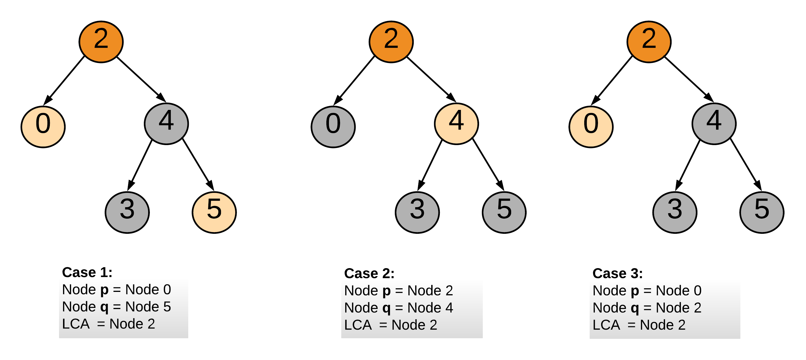

**按照DFS模板分析**

<!-- more -->

本题需要利用好**二分搜索树**的性质，即左子树值小于根节点，右子树值大于根节点；与之对应的[236. 二叉树的最近公共祖先](https://leetcode-cn.com/problems/lowest-common-ancestor-of-a-binary-tree/)则没有二分搜索树的性质

从根节点开始遍历树

1. 如果节点 pp 和节点 qq 都在右子树上，那么以右孩子为根节点继续 1 的操作
2. 如果节点 pp 和节点 qq 都在左子树上，那么以左孩子为根节点继续 1 的操作
3. 如果条件 2 和条件 3 都不成立，这就意味着我们已经找到节 pp 和节点 qq 的 LCA 了



```java
class Solution {
    public TreeNode lowestCommonAncestor(TreeNode root, TreeNode p, TreeNode q) {
        int parentVal = root.val;
        int pVal = p.val;
        int qVal = q.val;

        if (pVal > parentVal && qVal > parentVal) {
            return lowestCommonAncestor(root.right, p, q);
        } else if (pVal < parentVal && qVal < parentVal) {
            return lowestCommonAncestor(root.left, p, q);
        } else {
            return root;
        }
    }
}
```

**这里顺便解决一下**`236. 二叉树的最近公共祖先`，原理和Leetcode235基本一致，只不过没有二叉搜索树这个性质，需要判断左右子树是否为null

```java
class Solution {
    public TreeNode lowestCommonAncestor(TreeNode root, TreeNode p, TreeNode q) {
        if(root == null || root == p || root == q) return root;
        TreeNode left = lowestCommonAncestor(root.left, p, q);
        TreeNode right = lowestCommonAncestor(root.right, p, q);
        if(left == null) return right;
        if(right == null) return left;
        return root;
    }
}
```

