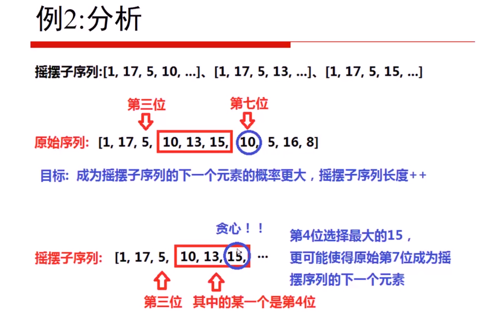
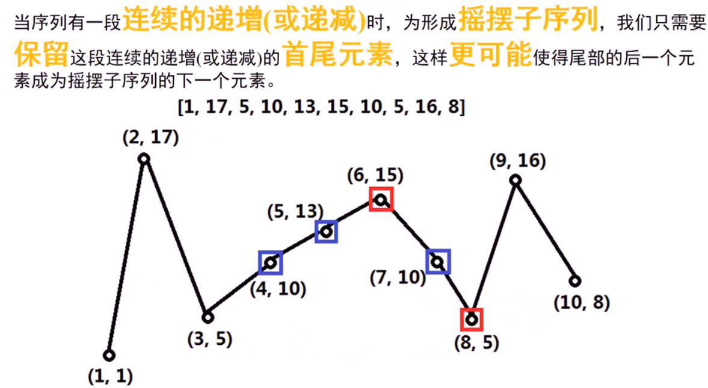
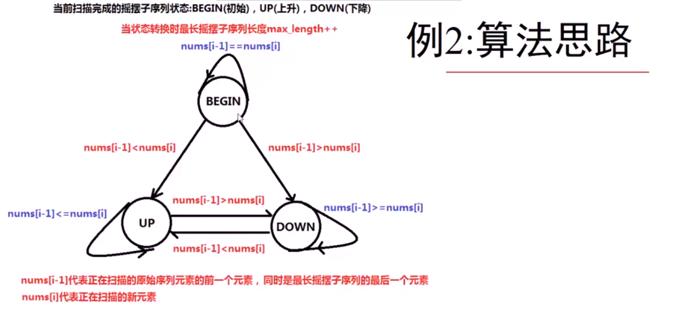
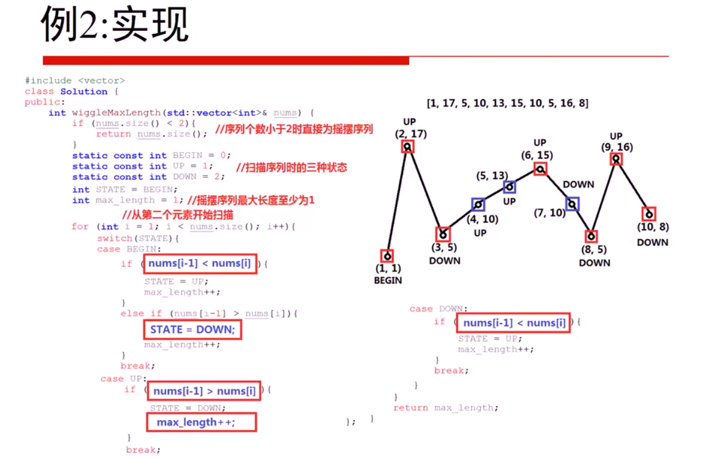

**转载自：[Leetcode题解（星缘），略有增删](https://leetcode-cn.com/problems/wiggle-subsequence/solution/bai-dong-xu-lie-dong-tai-gui-hua-tan-xin-jie-fa-by/)**

**能用贪心做的题目一定能用动态规划做**

<!-- more -->

### 1. 动态规划做法

1. 状态：长度维度标示(变化量)，用`i`来表述；**当前数组位置的值相对于前一个相邻位置上的值是上升的还是下降的**(相反对立量)，用`j`来表示，`j`的值为0和1；`dp[i][j] `标示为 以nums[i] 位置为结尾的 上升/下降 状态所对应的摇摆序列的最大长度

2. 最小状态：`dp[0][1] = 1; dp[0][0] = 1;`

3. 状态转移方程(通过对状态的循环多次，有几个状态就有几层循环，对立相反的状态只需写两行代码即可，不需要循环)

   **一个变化状态量和一个对立相反状态量，所以进行一次循环外加一次if判断**

   ```c++
   //我们分析一下 假设函数 dp(i) 标示 0-i 的摆序列最长的数字，我们如何求得 dp(i+1) ?
   //1. 如果 nums[i+1] > nums[i]   （末尾向上升）则 dp(i)如果是下降属性   dp(i+1) = dp(i) + 1
   // 如果 dp(i) 也是一个上升属性呢？ 则 dp(i+1) = dp(i)
   //2. 如果 nums[i+1] < nums[i]   (末尾向下) 则 dp(i) 如果是上升属性    dp(i+1) = dp(i) + 1
   // 如果 dp(i) 也是一个下降属性呢？ 则 dp(i+1) = dp(i)
   //3. 如果 nums[i+1] == nums[i]  (需要跳过的) 则 dp(i+1) = dp(i)
   ```

4. 返回最终状态：`return max(dp[n-1][0], dp[n-1][1]);`

```c++
int wiggleMaxLength1(vector<int>& nums) {
  int n = nums.size();
  if (n < 2) return n;
  vector<vector<int>>dp(n,vector(2,0));
  dp[0][0] = 1;
  dp[0][1] = 1;
  for(int i=1;i<n;i++){
    if(nums[i]<nums[i-1]){
      dp[i][0] = dp[i-1][1] + 1;
      dp[i][1] = dp[i-1][1];
    }else if(nums[i]>nums[i-1]){
      dp[i][1] = dp[i-1][0]+1;
      dp[i][0] = dp[i-1][0]; 
    }else{
      dp[i][1] = dp[i-1][1];
      dp[i][0] = dp[i-1][0]; 
    }
  }
  return max(dp[n-1][0],dp[n-1][1]);
}
```

### 2. 贪心算法(伪，好像这种做法看不出贪心在哪里-_-||，但毕竟是题解里给出的，先放着，但是肯定涉及到dp数组的维度压缩)

**其实基于动态规划 只需要考虑一点 "是否可以通过局部最优得到 全局最优？"**

有动态规划我们可以看出当然可以？我们可以从每次最优的里面选取下一个最优，最后对比即可

等量翻译一下 用up 代表 `dp[i][1]` ，用down 代表`dp[i][0]` 。剩下`dp[i-1][0/1] `如何标示，仔细考虑一下我们 在动态规划中只是想要让当前值继承前一个。如果我们不操作 up 或 down 是否就等同了 就是代码中注释部分

**感觉有点像二维dp数组的降维操作，只不过又把一维的dp数组使用单独的变量名来表示。即用up 代表 `dp[i][1]` ，用down 代表`dp[i][0]`**

```c++
int wiggleMaxLength2(vector<int>& nums) {
  int n = nums.size();
  if (n < 2) return n;
  int up=1;
  int down=1;
  for(int i=1;i<n;i++){
    if(nums[i]<nums[i-1]){
      down = up + 1;
      //up = up
    }else if(nums[i]> nums[i-1]){
      up = down +1;
      //down = down
    }
    /*else{
    	up = up;
      down = down;
     }*/
  }
  return max(down,up);
}
```

### 3. 贪心算法(真)



**简而言之，如何才能尽可能构造成一个摇摆情况呢？如果最高的和你都够不成摇摆情况，那就无论如何也不能摇摆了，这就涉及到了贪心算法，尽可能用一串序列的最高或者最低位构造摇摆；先不管具体代码实现，因为代码实现五花八门。一道题要么能用贪心，要么不能用，为什么能用贪心已经说明白了，**





**根据贪心思想，简而言之就是我要尽可能用极大极小值来作为子序列的构成部分。其实就是图中红色部分长度=7，如果一段序列一直增加或者减少则不增加最长序列长度，一旦改变了变化方向就另摇摆最大长度+1**

**状态条件判断可以参考动态规划解法里的思想，因为能用贪心做的一定能用动态规划做**

