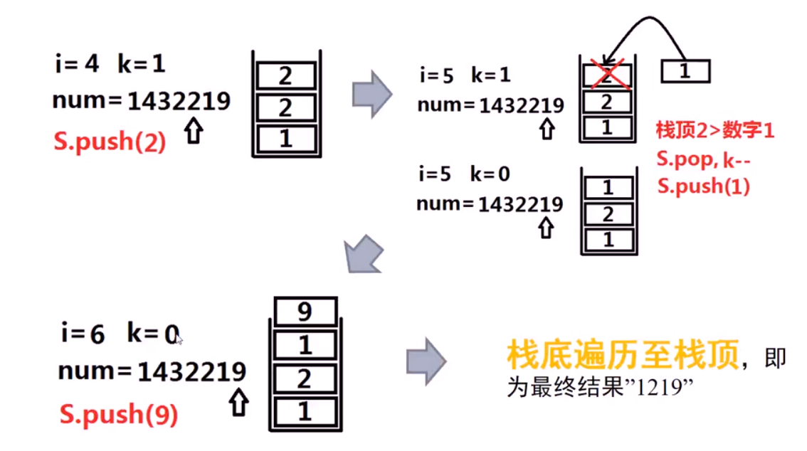

**假设数字1432219， k = 1，我们只去掉一个数字，应该去掉哪个？如果k>1，我们应该按照什么顺序与策略进行删除数字，得到结果最优？**

<!-- more -->

### 1. 贪心算法

尽可能让的得到的新数字优先最高位最小，这就是贪心思想


***


**若涉及到`比较，保留和删除`数组前后元素的情况，则大概率和`栈`或者`队列`结合起来**

**这两个数据结构能把数据存入(push)并且保留在体内进行判断(栈头或者队头元素与当前元素的比较)，同时又能通过出栈，出队(pop)，出队来进行删除**

**针对本道题**

1. 有元素之间的比较吗？有呀！看上一幅图，栈头元素与当前元素之间的比较
2. 有元素的保留吗？有呀！把最优结果保存在栈中
3. 有元素的删除吗？有呀！根据比较的结果删除元素(把栈头的元素出栈)

**这还不用栈来实现？**


***


***



***


```c++
class Solution {
public:
    string removeKdigits(string num, int k) {
        vector<int> s;
        string result = "";
        for(int i = 0; i < num.length(); i++){
            int number = num[i] - '0';
          	// 这里使用while而不用if的原因是
            // 如果特例为num = "1234560"，而k=6，则正确答案为0，可是使用if的结果为1
            while(s.size() != 0 && s[s.size() - 1] > number && k > 0){
                s.pop_back();
                k--;
            }
            if(number != 0 || s.size() != 0){
                s.push_back(number);
            }
        }
        while(s.size() != 0 && k > 0){
            s.pop_back();
            k--;
        }
        for(int i = 0; i < s.size(); i++){
            result.append(1, '0' + s[i]);
        }
        return result == ""? "0" : result;
    }
};
```

