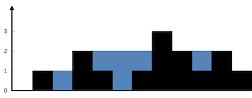
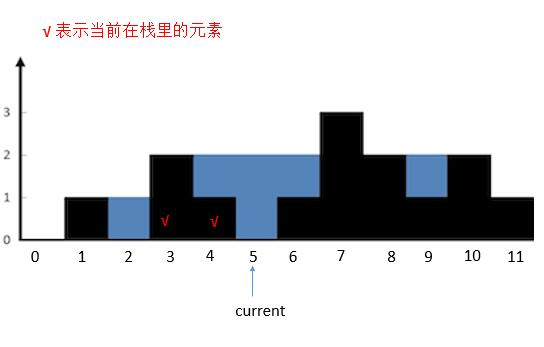

**转载自：[Leetcode题解（windliang），略有增删](https://leetcode-cn.com/problems/trapping-rain-water/solution/xiang-xi-tong-su-de-si-lu-fen-xi-duo-jie-fa-by-w-8/)**

**栈模板[使用栈解题思想](./使用栈解题思想.md)**

<!-- more -->



**先从使用栈的几个前提条件出发：**

1. 是否涉及到**比较**：雨水容积 = (左侧墙和右侧墙相减) * 两堵墙之间的距离，相减就是比较
2. 是否涉及到**延迟比较**：肯定先计算中间那两堵墙之间的容积再计算外侧两堵墙之间的容积，而根据数组从左到右的遍历顺序，最外侧左侧的那堵墙肯定是先被进行处理和判断的，但是他要和最后遍历到的右侧墙进行比较。所以涉及到延迟比较


**满足了延迟比较的特点，所以使用栈来辅助结题**


说到栈，我们肯定会想到括号匹配了。我们仔细观察蓝色的部分，可以和括号匹配类比下。每次匹配出一对括号（找到对应的一堵墙），就计算这两堵墙中的水。

**我们用栈保存每堵墙。**

当遍历墙的高度的时候，如果当前高度小于栈顶的墙高度，说明这里会有积水，我们将墙的高度的下标入栈。

如果当前高度大于栈顶的墙的高度，说明之前的积水到这里停下，我们可以计算下有多少积水了。计算完，就把当前的墙继续入栈，作为新的积水的墙。

总体的原则就是

1. 当前高度小于等于栈顶高度，入栈，指针后移。
2. 当前高度大于栈顶高度，出栈，计算出当前墙和栈顶的墙之间水的多少。然后计算当前的高度和新栈的高度的关系，重复第 2 步。直到当前墙的高度不大于栈顶高度或者栈空，然后把当前墙入栈，指针后移。

我们看具体的例子。

* 首先将 height [ 0 ] 入栈。然后 current 指向的高度大于栈顶高度，所以把栈顶 height [ 0 ] 出栈，然后栈空了，再把 height [ 1 ] 入栈。current 后移

  

* 然后 `current` 指向的高度小于栈顶高度，`height [ 2 ]` 入栈，`current` 后移。

  

* 然后 current 指向的高度大于栈顶高度，栈顶 height [ 2 ] 出栈。计算 height [ 3 ] 和新的栈顶之间的水。计算完之后继续判断 current 和新的栈顶的关系。

  

* `current` 指向的高度大于栈顶高度，栈顶 `height [ 1 ]` 出栈，栈空。所以把 `height [ 3 ]` 入栈。`currtent` 后移。

  

* 然后 `current` 指向的高度小于栈顶 `height [ 3 ]` 的高度，height `[ 4 ]` 入栈。`current` 后移。

  

* 然后 `current` 指向的高度小于栈顶 `height [ 4 ]` 的高度，`height [ 5 ]` 入栈。`current` 后移。

  

* 然后 current 指向的高度大于栈顶 height [ 5 ] 的高度，将栈顶 height [ 5 ] 出栈，然后计算 current 指向的墙和新栈顶 height [ 4 ] 之间的水。计算完之后继续判断 current 的指向和新栈顶的关系。此时 height [ 6 ] 不大于栈顶 height [ 4 ] ，所以将 height [ 6 ] 入栈。current 后移。

  

* 然后 current 指向的高度大于栈顶高度，将栈顶 height [ 6 ] 出栈。计算和新的栈顶 height [ 4 ] 组成两个边界中的水。然后判断 current 和新的栈顶 height [ 4 ] 的关系，依旧是大于，所以把 height [ 4 ] 出栈。计算 current 和 新的栈顶 height [ 3 ] 之间的水。然后判断 current 和新的栈顶 height [ 3 ] 的关系，依旧是大于，所以把 height [ 3 ] 出栈，栈空。将 current 指向的 height [ 7 ] 入栈。current 后移。

  

**我们根据栈模板中提到的`必写代码`来分析如下答案**

```java
public int trap(int[] height) {
    int sum = 0;
    Stack<Integer> stack = new Stack<>();
    int current = 0;
  	// 1. 必写代码之一：对原始数据的循环遍历
    while (current < height.length) {
      	// 2. 必写代码之二：对栈的判空，不管是用while还是if
        while (!stack.empty() && height[current] > height[stack.peek()]) {
          	// 3. 必写代码之三：取出栈顶元素
            int h = height[stack.peek()];
            // 4. 必写代码之四：出栈
            stack.pop();
            if (stack.empty()) { // 栈空就出去
                break; 
            }
          	// 获取栈顶元素之后的具体比较逻辑
            int distance = current - stack.peek() - 1; 
            int min = Math.min(height[stack.peek()], height[current]);
            sum = sum + distance * (min - h);
        }
      	// 5. 必写代码之五：入栈
      	// 对元素数据里的每一个元素都进行栈操作
        stack.push(current); 
        current++;
    }
    return sum;
}
```


