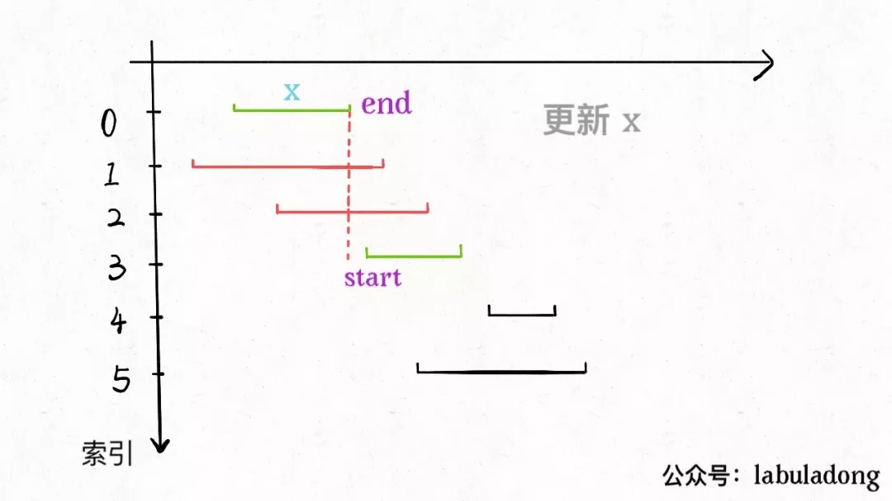

**转载自：[公众号（labuladong），略有增删](https://mp.weixin.qq.com/s/NH8GFMcRm5UK0HmVhdNjMQ)**

<!-- more -->

举个例子，`intvs=[[1,3],[2,4],[3,6]]`，这些区间最多有两个区间互不相交，即`[[1,3],[3,6]]`，你的算法应该返回 2。注意边界相同并不算相交。

这个问题在生活中的应用广泛，比如你今天有好几个活动，每个活动都可以用区间`[start,end]`表示开始和结束的时间，请问你**今天最多能参加几个活动呢？**

### 1. 贪心

这个问题有许多看起来不错的解决思路，实际上都不能得到正确答案。比如说：

也许我们可以每次选择可选区间中开始最早的那个？但是可能存在某些区间开始很早，但是很长，使得我们错误地错过了一些短的区间。

或者我们每次选择可选区间中最短的那个？或者选择出现冲突最少的那个区间？这些方案都能很容易举出反例，不是正确的方案。

正确的思路其实很简单，可以分为以下三步：

1. 从区间集合 intvs 中选择一个区间 x，这个 x 是在当前所有区间中**结束最早的**（end 最小）。
2. 把所有与 x 区间相交的区间从区间集合 intvs 中删除。
3. 重复步骤 1 和 2，直到 intvs 为空为止。之前选出的那些 x 就是最大不相交子集。

把这个思路实现成算法的话，可以按每个区间的`end`数值升序排序，因为这样处理之后实现步骤 1 和步骤 2 都方便很多:

现在来实现算法，对于步骤 1，由于我们预先按照`end`排了序，所以选择 x 是很容易的。关键在于，如何去除与 x 相交的区间，选择下一轮循环的 x 呢？

**由于我们事先排了序**，不难发现所有与 x 相交的区间必然会与 x 的`end`相交；如果一个区间不想与 x 的`end`相交，它的`start`必须要大于（或等于）x 的`end`：



我们已经会求最多有几个区间不会重叠了，那么剩下的不就是至少需要去除的区间吗？

```java
class Solution {
    public int eraseOverlapIntervals(int[][] intervals) {
        if (intervals.length == 0) return 0;
        // 按 end 升序排序
        Arrays.sort(intervals, new Comparator<int[]>() {
            public int compare(int[] a, int[] b) {
                return a[1] - b[1];
            }
        });
        // 至少有一个区间不相交
        int count = 1;
        // 排序后，第一个区间就是 x
        int x_end = intervals[0][1];
        for (int[] interval : intervals) {
            int start = interval[0];
            if (start >= x_end) {
                // 找到下一个选择的区间了
                count++;
                x_end = interval[1];
            }
        }
        return intervals.length - count;
    }
}
```

