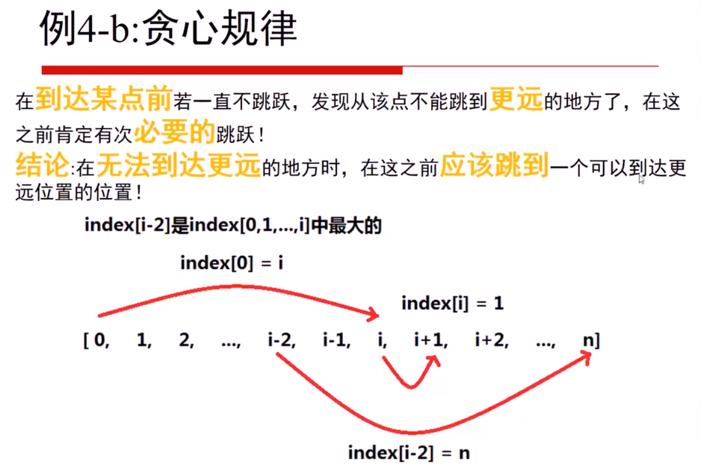
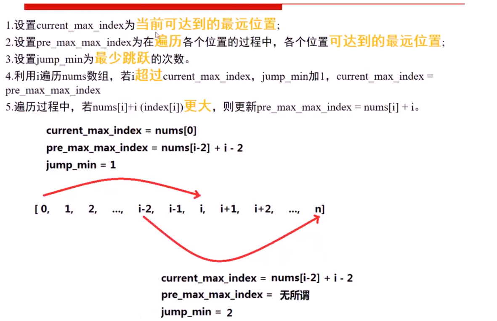

**转载自：[Leetcode题解（yang tianrui），略有增删](https://leetcode-cn.com/problems/jump-game-ii/)**

<!-- more -->

**能用贪心做的题目一定能用动态规划做**

### 1. 动态规划

1. 状态：数组下标(变化量)，用`i`来表示。`dp[i]`表示从起点开始，为跳到点`i`需要的最小步数。

2. 最小状态：`dp[0] = 0`，原点不用跳

3. 状态转移方程(通过对状态的循环多次，有几个状态就有几层循环，对立相反的状态只需写两行代码即可，不需要循环)：**一个状态一次循环，第二层循环可不是状态量的循环，之前在动态规划模板中也有说明**

   ```c++
   for (int i = 1; i < n; i++) {
     for (int j = 0; j < i; j++) { 
       if (j + nums[j] >= i) { 
         dp[i] = min(dp[i], dp[j] + 1);
       }
     }
   }
   ```
   
4. 返回最终状态：return dp[n]；或者其他

```c++
// 很遗憾动态规划超时了，所以想办法优化。
class Solution {
public:
    int jump(vector<int>& nums) {
        int n = nums.size();
        vector<int> f(n, 0x3f3f3f3f);
      	dp[0] = 0;
        for (int i = 0; i < n; i++) {
            for (int j = 0; j < i; j++) { 
              	if (j + nums[j] >= i) { // 只要前面的点能跳到i点就更新最小值
                		dp[i]] = min(dp[i], dp[j] + 1);
                }
            }
        }
        return f[n - 1];
    }
};
```

### 2. 贪心


***



***



```c++
class Solution {
public:
    int jump(vector<int>& nums) {
        if(nums.size() < 2){
            return 0;
        }
        int current_max_index = nums[0];
        int pre_max_max_index = nums[0];
        int jump_min = 1;
        for(int i = 1; i < nums.size(); i++){
            if(i > current_max_index){  // 若无法继续向前移动了，才进行跳跃
                jump_min++;     // 更新当前可当最远位置
                current_max_index = pre_max_max_index;
            }
            if(pre_max_max_index < nums[i] + i){
                pre_max_max_index = nums[i] + i;
            }
        }
        return jump_min;
    }
};
```

