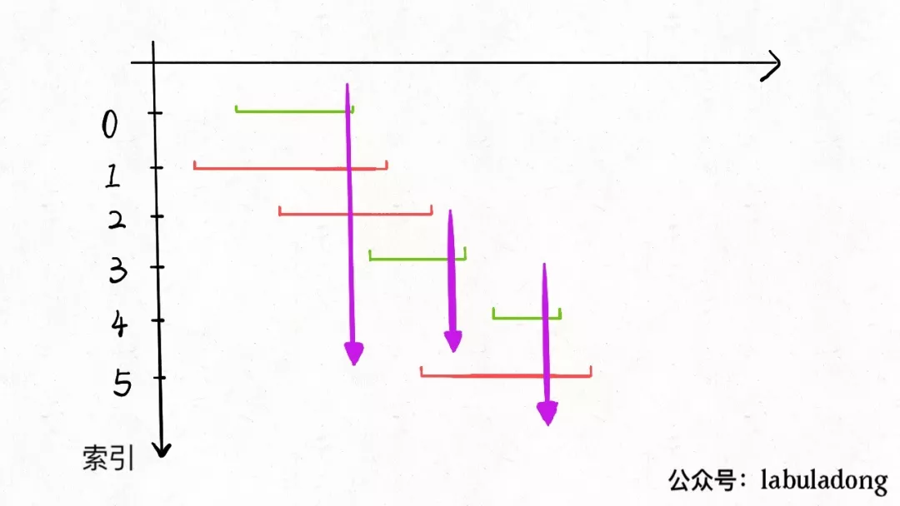
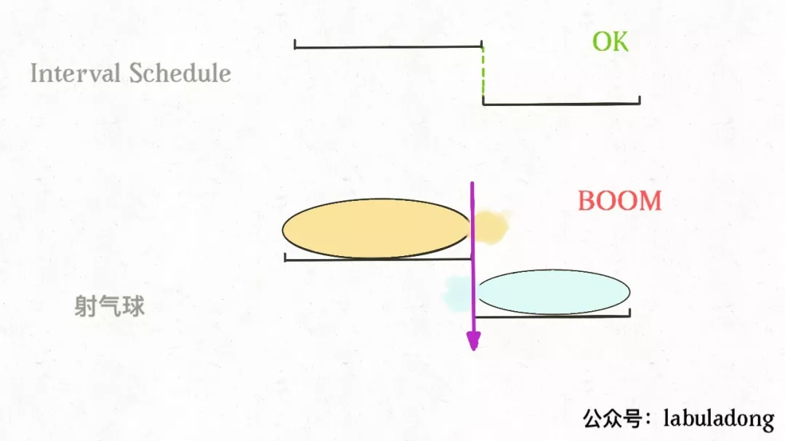

**转载自：[公众号（labuladong），略有增删](https://mp.weixin.qq.com/s/NH8GFMcRm5UK0HmVhdNjMQ)**

<!-- more -->

其实稍微思考一下，这个问题和[Leetcode435. 区间调度算法](https://leetcode-cn.com/problems/non-overlapping-intervals/)一模一样！如果最多有`n`个不重叠的区间，那么就至少需要`n`个箭头穿透所有区间：



只是有一点不一样，在`intervalSchedule`算法中，如果两个区间的边界触碰，不算重叠；而按照这道题目的描述，箭头如果碰到气球的边界气球也会爆炸，所以说相当于区间的边界触碰也算重叠：



所以只要将之前的算法稍作修改，就是这道题目的答案：

```java
class Solution {
    public int findMinArrowShots(int[][] points) {
        if (points.length == 0) return 0;
        // 按 end 升序排序
        Arrays.sort(points, new Comparator<int[]>() {
            public int compare(int[] a, int[] b) {
                return a[1] - b[1];
            }
        });
        // 至少有一个区间不相交
        int count = 1;
        // 排序后，第一个区间就是 x
        int x_end = points[0][1];
        for (int[] point : points) {
            int start = point[0];
          	// 把 >= 改成 > 就行了
            if (start > x_end) {
                // 找到下一个选择的区间了
                count++;
                x_end = point[1];
            }
        }
        return count;
    }
}
```

