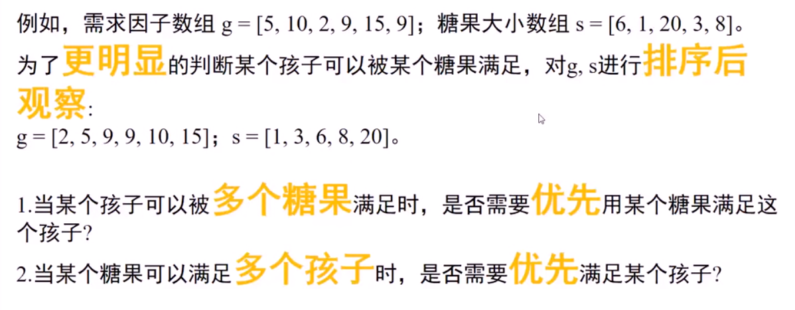
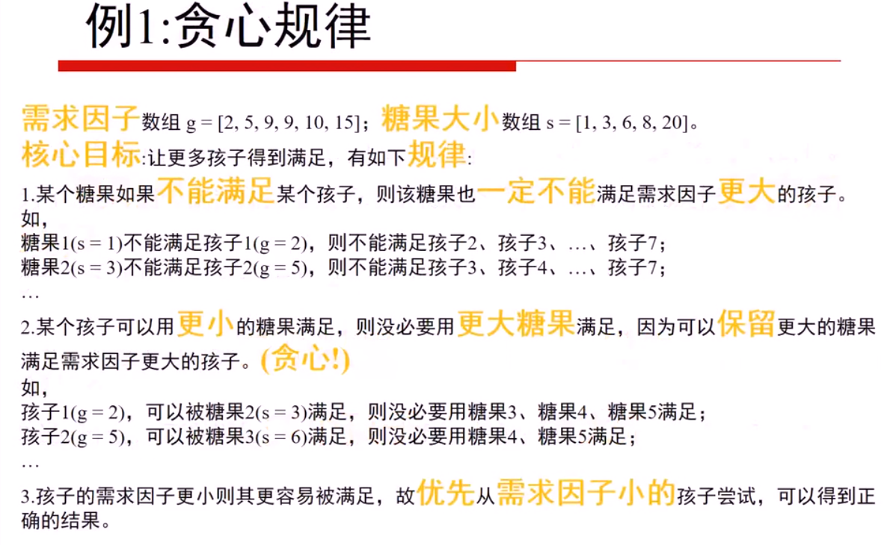
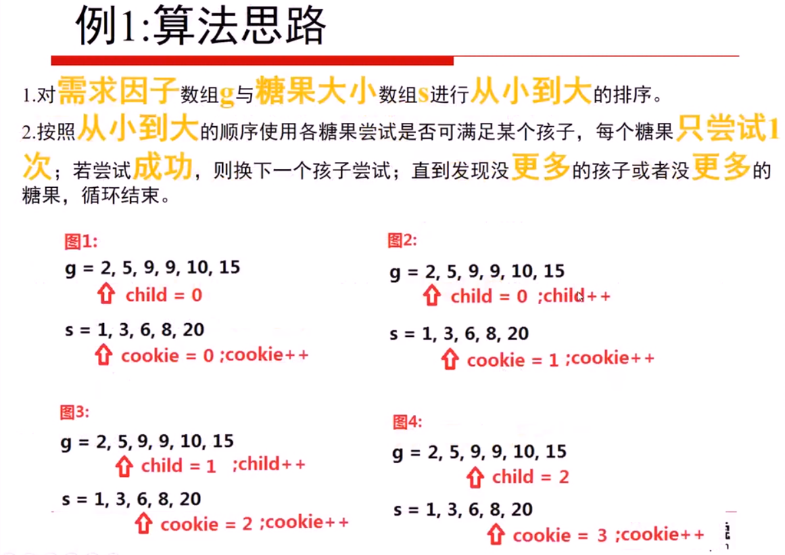
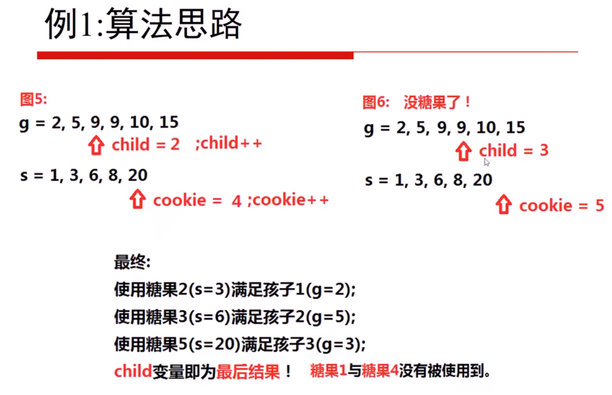

**能用贪心算法的题目一定能用动态规划来做，但是这道题可能是由于状态转移方程或者状态没有设定正确，导致最后的结果与题意有一定差距，但是也能证明使用动态规划的想法是正确的的**

<!-- more -->

#### 动态规划做法(错误)

1. 状态：孩子和饼干数组的下标`i和j`，`dp[i][j]`表示用前`j`块饼干能满足前`i`个孩子之间最大多少个孩子

2. 最小状态：`dp[...][0] = 0`，没有饼干提供自然一个孩子都不能满足，`dp[0][...] = 0`，没有孩子，即使有饼干也无法满足，基于以上初始值，直接使用`vector<vector<int>> dp(len1 + 1, vector<int>(len2 + 1, 0));`来初始化

3. 状态转移方程(通过对状态的循环多次，有几个状态就有几层循环，对立相反的状态只需写两行代码即可，不需要循环)：**两个状态，两次嵌套循环**

   ```c++
   // 这种状态转移方程会导致一块饼干被多个孩子分食，这也是与题意相悖的地方
   // 如果题目给定同一重量的饼干有无数块，这种动态规划做法是完全正确的！！！
   for(int i = 1; i <= len1; i++){
     for(int j = 1; j <= len2; j++){
       // 同样由于状态设定导致饼干数组下标和状态量差了一个偏移位
       // 如果当前作比较的饼干重量  大于  当前作比较的孩子满意饼干大小
       if(s[j - 1] >= g[i - 1]){
         dp[i][j] = dp[i - 1][j] + 1;
         // 有人会说既然一个饼干只能用一次，那么转移方程写成dp[i][j] = dp[i - 1][j - 1] + 1不就好了
         // 确实会有这种想法，但是如果数据集为
         // [10,9,8,7]
   		// [5,6,7,8]
         // 正确结果为2，但是按照上面的转移方程结果就是1
       } else {
         dp[i][j] = max(dp[i - 1][j], dp[i][j - 1]);
       }
     }
   }
   ```

4. 返回最终状态：`dp[len1][len2]`;

#### 贪心做法









```c++
class Solution {
public:
    int findContentChildren(vector<int>& g, vector<int>& s) {
        sort(s.begin(), s.end());
        sort(g.begin(), g.end());
        int cookie = 0;
        int child = 0;
        while(cookie < s.size() && child < g.size()){
            if(g[child] <= s[cookie]){ // 当孩子的满足因子小于等于糖果大小时
                child++;
            }
            cookie++;	// 无论成功失败，每个糖果只尝试一次
        }
        return child;	// 最终child即为得到满足的孩子的个数
    }
};
```

