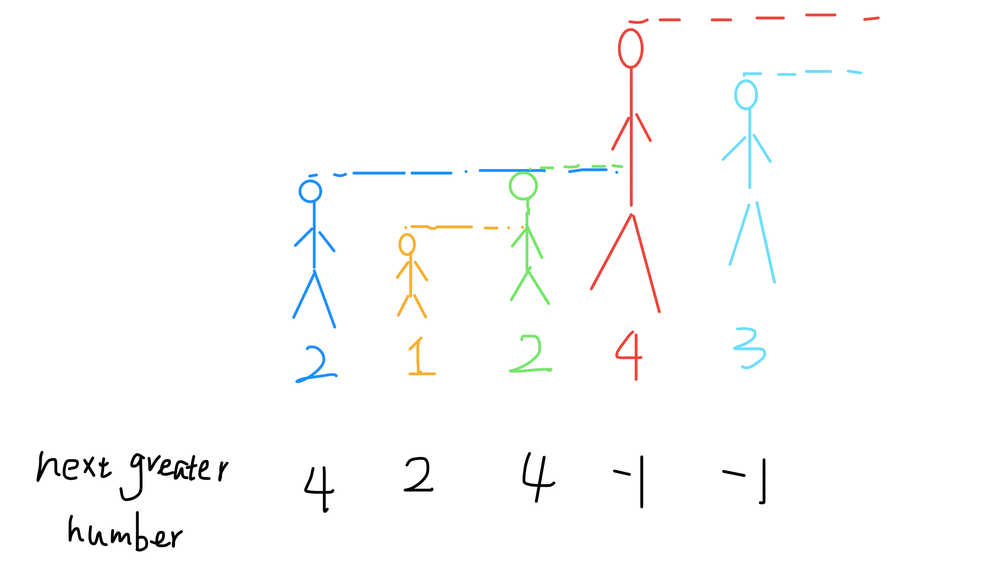

**转载自：[Leetcode题解（labuladong），略有增删](https://leetcode-cn.com/problems/next-greater-element-i/solution/dan-diao-zhan-jie-jue-next-greater-number-yi-lei-w/)**

**栈模板[使用栈解题思想](./使用栈解题思想.md)**

<!-- more -->

先从使用栈的几个前提条件出发：

1. 是否涉及到**比较**：题目为下一个更大的元素，当然涉及比较
2. 是否涉及到**延迟比较**：下一个比当前元素大的元素可能隔着十万八千里，但是是存在的，所以需要保存，这就涉及了延迟比较

**但是这道题有点特殊，需要从后往前遍历，但是除此之外完全符合模板解题思路**

这个问题可以这样抽象思考：把数组的元素想象成并列站立的人，元素大小想象成人的身高。这些人面对你站成一列，如何求元素「2」的 Next Greater Number 呢？很简单，如果能够看到元素「2」，那么他后面可见的第一个人就是「2」的 Next Greater Number，因为比「2」小的元素身高不够，都被「2」挡住了，第一个露出来的就是答案。



for 循环要从后往前扫描元素，因为我们借助的是栈的结构，倒着入栈，其实是正着出栈。while 循环是把两个“高个”元素之间的元素排除，因为他们的存在没有意义，前面挡着个“更高”的元素，所以他们不可能被作为后续进来的元素的 Next Great Number 了。

```c++
vector<int> nextGreaterElement(vector<int>& nums) {
    vector<int> ans(nums.size()); // 存放答案的数组
    stack<int> s;
    for (int i = nums.size() - 1; i >= 0; i--) { // 倒着往栈里放
        while (!s.empty() && s.top() <= nums[i]) { // 判定个子高矮
            s.pop(); // 矮个起开，反正也被挡着了。。。
        }
        ans[i] = s.empty() ? -1 : s.top(); // 这个元素身后的第一个高个
        s.push(nums[i]); // 进队，接受之后的身高判定吧！
    }
    return ans;
}
```


