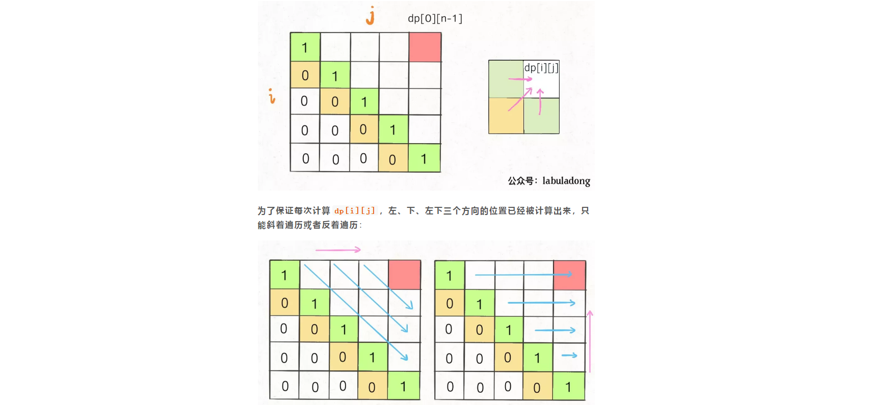

**转载自：[Leetcode题解（labuladong），略有增删](https://leetcode-cn.com/problems/longest-palindromic-subsequence/solution/zi-xu-lie-wen-ti-tong-yong-si-lu-zui-chang-hui-wen/)**

<!-- more -->

**虽然烦，但还是要写公式-_-||**

1. 状态：本道题完美契合设两个状态量，一个起始下标i，一个终止下标j，dp[i] [j]意思是以i起点，j为终点的子数组的最长回文子序列，因为`可以通过两侧的dp[i - 1] [j]和dp[i] [j - 1]推出dp[i] [j]`

2. 最小状态：dp[i] [i] = 1，每个元素自身都是回文子序列，因为i肯定小于等于j，所以对于那些i > j的位置，根本不存在什么子序列，应该初始化为 0

3. 状态转移方程(通过对状态的循环多次，有几个状态就有几层循环，对立相反的状态只需写两行代码即可，不需要循环)，**还记得不能由未知推已知吗**

   

```c++
// 两层嵌套循环以及注意状态元素的起始值
for (int i = n - 1; i >= 0; i--) {
  for (int j = i + 1; j < n; j++) {
    // 状态转移方程，一次if判断
    if (s[i] == s[j])
      // 它俩一定在最长回文子序列中
      dp[i][j] = dp[i + 1][j - 1] + 2;
    else
      // s[i+1..j] 和 s[i..j-1] 谁的回文子序列更长？
      dp[i][j] = max(dp[i + 1][j], dp[i][j - 1]);
  }
}
```

4. 返回最终状态：**return** dp[0] [n - 1];   表示整个 s 的最长回文子串长度

```c++
class Solution {
public:
  int longestPalindromeSubseq(string s) {
    int n = s.size();
    vector<vector<int>> dp(n, vector<int>(n, 0));
    for (int i = 0; i < n; i++) {
      dp[i][i] = 1;
    }
    for (int i = n - 1; i >= 0; i--) {
      for (int j = i + 1; j < n; j++) {
        if (s[i] == s[j])
          dp[i][j] = dp[i + 1][j - 1] + 2;
        else
          dp[i][j] = max(dp[i + 1][j], dp[i][j - 1]);
      }
    }
    return dp[0][n - 1];
  }
};
```

