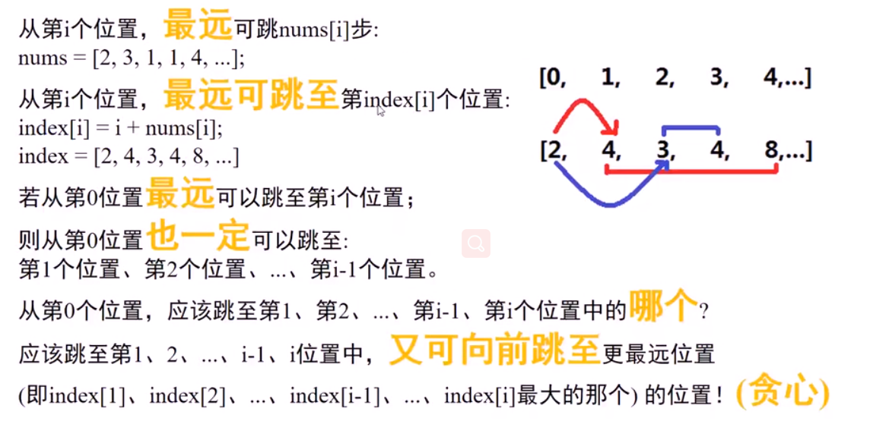
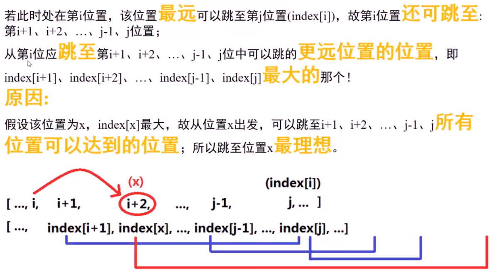
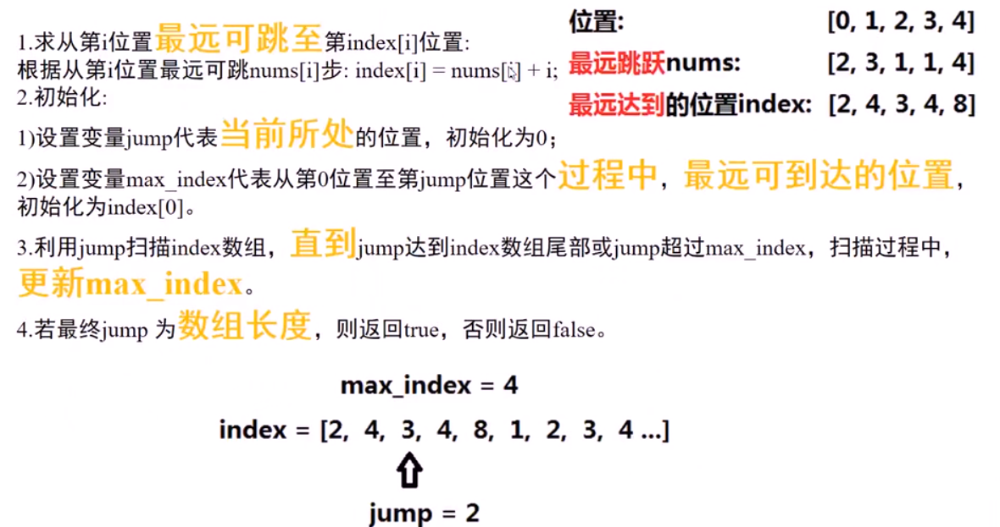
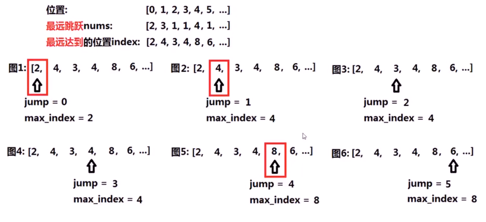

**转载自：[Leetcode题解（yang tianrui），略有增删](https://leetcode-cn.com/problems/n-queens/solution/hui-su-suan-fa-xiang-jie-by-labuladong/)**

<!-- more -->

**能用贪心做的题目一定能用动态规划做**

### 1. 动态规划

1. 状态：数组下标(变化量)，用`i`来表示。`dp[i]`表示从起点开始，能否跳到以`i`结尾的地方(**bool值**)

2. 最小状态：`dp[0] = true`起点自身当然能跳到

3. 状态转移方程(通过对状态的循环多次，有几个状态就有几层循环，对立相反的状态只需写两行代码即可，不需要循环)：**一个状态一次循环，第二层循环可不是状态量的循环，之前在动态规划模板中也有说明**

   ```c++
   for (int i = 1; i < nums.length; i++) {
     for (int j = 0; j < i; j++) {
       // 如果之前的j节点可达，并且从此节点可以到跳到i
       if (dp[j] && nums[j] + j >= i) {
         dp[i] = true;
         break;
       }
     }
   }
   ```

4. 返回最终状态：`dp[nums.length - 1];`

```c++
// 为什么Leetcode上超时了，嘤嘤嘤
class Solution {
public:
    bool canJump(vector<int>& nums) {
        int len = nums.size();
        vector<int> dp(len, false);
        dp[0] = true;
        for(int i = 1; i < len; i++){
            for(int j = 0; j < i; j++){
                if(dp[j] && nums[j] + j >= i){
                    dp[i] = true;
                    break;
                }
            }
        }
        return dp[len - 1];
    }
};
```

### 2. 贪心


***



***



***



***



```c++
class Solution {
public:
    bool canJump(vector<int>& nums) {
        vector<int> index;
        for(int i = 0; i < nums.size(); i++){
            index.push_back(i + nums[i]);
        }
        int jump = 0;
        int max_index = nums[0];
        while(jump < index.size() && jump <= max_index){
            if(max_index < index[jump]){
                max_index = index[jump];
            }
            jump++;
        }
        return jump == index.size();
    }
};
```

