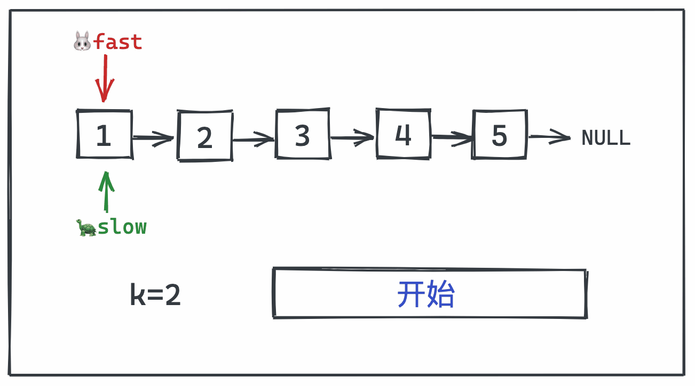

**一般旋转指针的题目都是使用数字取余的方式做的，但是使用快慢指针方法更加直观。以后做链表的题目多想想能不能用快慢指针的方法做**

**转载自：[Leetcode题解（一个歪卜），略有增删](https://leetcode-cn.com/problems/rotate-list/solution/dong-tu-suan-fa-xuan-zhuan-lian-biao-si-chong-ji-3/)**，请结合该文处理链表题目的[方法分析链表解题思路](./链表解题思路.md)

<!-- more -->



```c++
class Solution {
public:
    ListNode* rotateRight(ListNode* head, int k) {
        if(head == NULL){
            return head;
        }
        ListNode *fast = head, *slow = head;
        while(k--){
            if(fast->next != NULL){
                fast = fast->next;
            } else {
                fast = head;
            }
        }
      	// slow == fast说明k会被链表长度整除，故无需操作head直接返回即可
        if(slow == fast){
            return head;
        }
        while (fast->next) {
            slow = slow->next;
            fast = fast->next;
        }
        // 对慢指针位置进行打断
        fast->next = head;
        head = slow->next;
        slow->next = NULL;
        return head;
    }
};
```