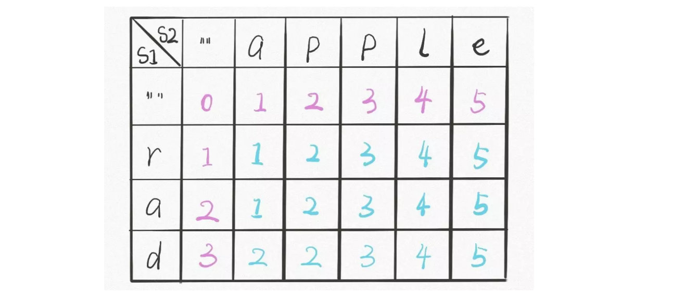

**转载自：[Leetcode题解（labuladong），略有增删](https://leetcode-cn.com/problems/edit-distance/solution/bian-ji-ju-chi-mian-shi-ti-xiang-jie-by-labuladong/)**

<!-- more -->

**虽然烦，但还是要写公式-_-||**

1. 状态：应该很容易得出，两个字符串的下标对应着两个状态分别为i和j；`dp[i][j]`表示对于`s1[1..i]`和`s2[1..j]`，最少需要进行多少次的操作才能使s1彻底变成s2串

2. 最小状态：**专门让索引为 0 的行和列表示空串，这也是在二维dp数组中常见的操作，特意把下标为0的元素特殊化，同时把末尾元素也延长一位**，都应该初始化为`dp[0][j] = j`和`dp[i][0] = i`，毕竟从空串变成一个长度为n的字符串就是不断地添加n次字符即可

   

3. 状态转移方程(通过对状态的循环多次，有几个状态就有几层循环，对立相反的状态只需写两行代码即可，不需要循环)：**两个状态，两次嵌套循环**

   ```c++
   // 对于每对字符s1[i]和s2[j]，可以有四种操作：
   if s1[i] == s2[j]:
       啥都别做（skip）
       i, j 同时向前移动
   else:
       三选一：
           插入（insert）
           删除（delete）
           替换（replace）
   ```

   ```c++
   if s1[i] == s2[j]:
       return dp(i - 1, j - 1)  # 啥都不做
   # 解释：
   # 本来就相等，不需要任何操作
   # s1[0..i] 和 s2[0..j] 的最小编辑距离等于
   # s1[0..i-1] 和 s2[0..j-1] 的最小编辑距离
   # 也就是说 dp(i, j) 等于 dp(i-1, j-1)
   ```

   如果`s1[i]！=s2[j]`，就要对三个操作递归了，稍微需要点思考：

   ```c++
   dp(i - 1, j - 1) + 1 # 替换
   # 解释：
   # 我直接把 s1[i] 替换成 s2[j]，这样它俩就匹配了
   # 同时前移 i，j 继续对比
   # 操作数加一
   ```

   **其实从i - 1和j - 1这个元素下标以及结合二维dp数组就能够猜到另外两种情况的下标对应着什么**

   **大概率是dp[i - 1] [j]和dp[i] [j - 1]，事实也确实是这两种情况**

   ```c++
   for (int i = 1; i <= m; i++){
     for (int j = 1; j <= n; j++){
       // word下标是从0开始的，而dp下标是从1开始的，所以需要i - 1
       if (word1[i - 1] == word2[j - 1]){
         dp[i][j] = dp[i - 1][j - 1];
       }
       else{
         dp[i][j] = min3(dp[i - 1][j] + 1,dp[i][j - 1] + 1,dp[i-1][j-1] + 1);    
       }   
     }
   }
   ```

4. 返回最终状态：return dp[m] [n];

```c++
class Solution {
private:  
  int min3(int a, int b, int c) {
      return min(a, min(b, c));
  }
public:
  int minDistance(string word1, string word2) {
    int m = word1.size(), n = word2.size();
    vector<vector<int>> dp(m + 1, vector<int>(n + 1, 0));
    
    for (int i = 1; i <= m; i++)
      dp[i][0] = i;
    for (int j = 1; j <= n; j++)
      dp[0][j] = j;    
    
    for (int i = 1; i <= m; i++)
      for (int j = 1; j <= n; j++)
        if (word1[i - 1] == word2[j - 1])
          dp[i][j] = dp[i - 1][j - 1];
        else               
          dp[i][j] = min3(
            dp[i - 1][j] + 1,
            dp[i][j - 1] + 1,
            dp[i-1][j-1] + 1
          );
    // 储存着整个 s1 和 s2 的最小编辑距离
    return dp[m][n];      
  }
};
```

