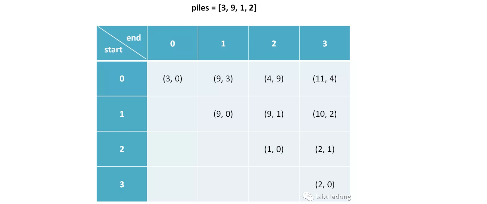
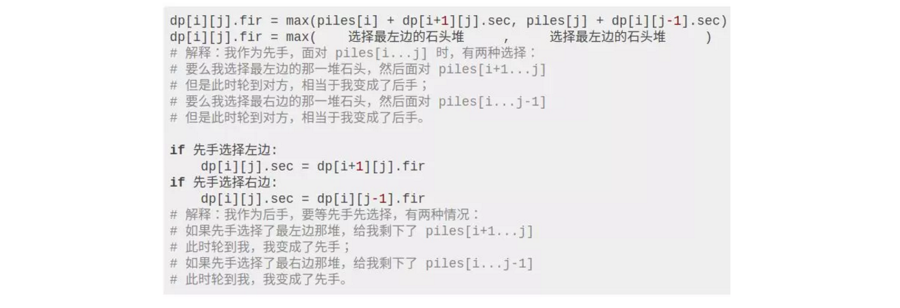
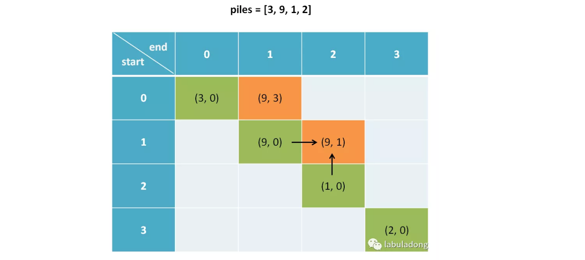

**转载自：[Leetcode题解（labuladong），略有增删](https://leetcode-cn.com/problems/stone-game/solution/jie-jue-bo-yi-wen-ti-de-dong-tai-gui-hua-tong-yong/)**

<!-- more -->

1. 状态：数组下标(变化量)，用下标`i`表示；先手还是后手拿(对立相反量)，表示成0与1**不过题解中以pair形式表示，也是可以的，本质上还是只使用两个值来表示相反的量；注：本来对于数组元素的状态就是一个下标志`i`，但是如果同时考虑到假如在数组的左右两端取石头的话，还是比较容易想到，再添加一个状态量`j`，用dp[i] [j]表示石头数组左右两端之间的元素**，则`dp[i][j].fir`表示从`piles[i...j]`之间先手能拿到的最大重量，`dp[i][j].sec`表示从`piles[i...j]`之间后手能拿到的最大重量

   

   

2. 最小状态：`dp[i][i].fir = piles[i]，dp[i][i].sec = 0`，当只有一堆石头的时候先拿得全部，后拿什么都没有

3. 状态转移方程(通过对状态的循环多次，有几个状态就有几层循环，对立相反的状态只需写两行代码即可，不需要循环)：**三个状态量，其中两个变化量导致两次嵌套循环；一个对立相反量采用if判断**

   

   **同时要注意根据已知推未知，观察转移量的数组下标，`dp[i + 1][j]以及dp[i][j - 1]`，可以判断是从右下角往上推的**

   

   

4. 返回最终状态：`return dp[0][n−1].fir > dp[0][n−1].sec`；**我们想求的答案是先手和后手谁跟大**

```c++
class Solution {
public:
    bool stoneGame(vector<int>& piles) {
        int len = piles.size();
        pair<int,int> dp[len][len];
        for(int i = 0; i < len; i++){
            for(int j = i; j < len; j++){
                dp[i][j] = make_pair<int,int>(0, 0);
            }
        }
        for(int i = 0; i < len; i++){
            dp[i][i].first = piles[i];
            dp[i][i].second = 0;
        }
        for(int i = len - 2; i >= 0; i--){
            for(int j = i + 1; j < len; j++){
                int left = piles[i] + dp[i + 1][j].second;
                int right = piles[j] + dp[i][j - 1].second;

                if(left > right){
                    dp[i][j].first = left;
                    dp[i][j].second = dp[i + 1][j].first;
                } else {
                    dp[i][j].first = right;
                    dp[i][j].second = dp[i][j - 1].first;
                }
            }
        }
        return dp[0][len - 1].first > dp[0][len - 1].second;
    }
};
```

