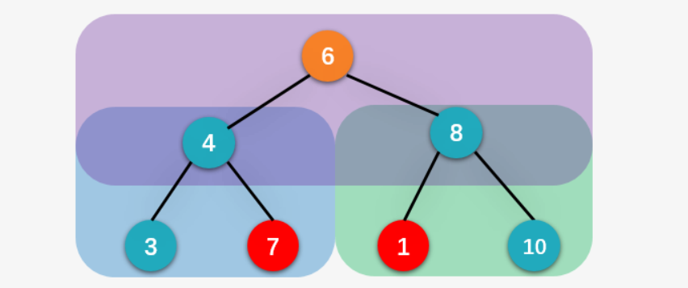

**转载自：[Leetcode题解（Novice2Master），略有增删](https://leetcode-cn.com/problems/validate-binary-search-tree/solution/bao-zhun-sheng-guo-guan-fang-ti-jie-by-novice2mast/)**

<!-- more -->

#### 方法一（简单但错误的方法）

最简单的方式就是对每一个顶点，判断其左孩子是不是比它小，左孩子是否比它大。

```c++
bool isValidBST(struct TreeNode* root){
    if( root == NULL ) return true;
    if( root->left != NULL && root->left->val > root->val ) 
        return false;
    if( root->right != NULL && root->right->val < root->val ) 
        return false;
    if( !isValidBST(root->left) || !isValidBST(root->right) ) 
        return false;
    
    return true;
}
```

这种解法的问题出在：二叉排序树的性质是一个节点的**左右子树而不是左右孩子节点**



上图中的根结点是 6 ，而其左子树中的结点 7 大于 6 ，显然不符合二叉排序树的定义；右子树当中的结点 1 小于根结点 6，同样是不合理的；但是你发现上面程序会返回 true，因为上面的程序仅检查了一个结点的左孩子和右孩子，我们自然想到检查一个的结点左子树当中的最大顶点是否比结点小，右子树当中值最小的顶点是否比结点大不就好了，比如根结点 6 的左子树当中最大的顶点为 7 大于 6 ，所以不是一颗二叉排序树，返回false;

#### 方法二（正确但并不高效）

对于每一个结点，检查结点左子树中值最大的结点的值是否小于结点，右子树中值最小的结点是否大于结点。

```c++
/**
 * Definition for a binary tree node.
 * struct TreeNode {
 *     int val;
 *     TreeNode *left;
 *     TreeNode *right;
 *     TreeNode(int x) : val(x), left(NULL), right(NULL) {}
 * };
 */
class Solution {
private:
    int minValueNode(struct TreeNode* node) {
        struct TreeNode* current = node;

        /*从删除结点的右孩子开始一直向左走，找到最小值*/
        while (current && current->left != NULL)
            current = current->left;

        return current->val;
    }

    /* 返回删除结点左子树当中的值最大的结点指针 */
    int maxValueNode(struct TreeNode* node) {
        struct TreeNode* current = node;

        /*从删除结点的右孩子开始一直向左走，找到最小值*/
        while (current && current->right != NULL)
            current = current->right;

        return current->val;
    }
public:
    bool isValidBST(struct TreeNode* root){
        if(root == NULL) return true;
      
      	// 分
      	if(!isValidBST(root->left) || !isValidBST(root->right)) return false;
				// 治
        if(root->left != NULL && maxValueNode(root->left) >= root->val) return false;
        if(root->right != NULL && minValueNode(root->right) <= root->val) return false;

        return true;
    }
};
```

**注：这里提一点递归和分而治之的联系与区别**

* 递归策略分为（减而治之和分而治之）

* 减而治之就是俗称的递归：求解一个大规模的问题，可以将其划分为两个子问题，其一是平凡问题，另一个规模缩减。由子问题的解，得到原问题的解。

  ```java
  int sum(int A[], int n)
  {
      return (n < 1)?0:A[n-1]+sum(A,n-1);
  }
  ```

* 分而治之：求解一个大规模的问题，可以将其划分为多个（通常情况下为两个）子问题，两个问题的规模大体相同。由子问题的解，得到原问题的解。

  ```java
  int sum(int A[], int low, int high)
  {
  return (low == high) ? 
    A[low] : sum(A, low, (low + high) >> 1) + sum(A, ((low + high) >> 1) + 1, high);
  }
  ```

* 分而治之简单来讲分为两个角度，三个步骤

  1. 分

     1. 确定分到最小单元要做的操作，也就是俗称的递归终止条件，简而言之就是在你脑子里`最容易想到`的一种操作情况，**比如让你去区分一颗树是不是二分搜索树，当一棵树为空树的时候就是一颗最简单的二分搜索树**，这种情况是最容易想到的，即

        ```java
        if(root == NULL) return true;
        ```

     2. 使用递归模板去`分`，但在写递归模板的时候，`函数的参数要和总函数一致，即函数思想要一致`

        ```java
        isValidBST(root->left)
        isValidBST(root->right)
        ```

  2. 治：建立分和总之间的联系，由分推总(**这部分的代码是最难想的，是涉及到具体的代码判断，赋值等操作的**)。**既然分和总函数有着同样的思想**，那么两者函数的参数和返回值均相同，分函数的返回值为bool，那么总函数的返回值也是bool；即分函数是判断一颗子树是不是二叉搜索树，那么总函数也是判断一颗树是不是二叉搜索树。那么如何判断呢？**找到左子树的最大值和右子树的最小值，然后跟根节点数值进行比较，这就是具体的代码判断赋值操作**

     ```java
     // 找左子树最大值
     int minValueNode(struct TreeNode* node) {
         struct TreeNode* current = node;
     
         /*从删除结点的右孩子开始一直向左走，找到最小值*/
         while (current && current->left != NULL)
           	current = current->left;
     
         return current->val;
     }
     
     // 找右子树最大值
     int maxValueNode(struct TreeNode* node) {
         struct TreeNode* current = node;
     
         /*从删除结点的右孩子开始一直向左走，找到最小值*/
         while (current && current->right != NULL)
           	current = current->right;
     
         return current->val;
     }
     ```

     ```java
     // 跟根节点数值进行比较
     if(root->left != NULL && maxValueNode(root->left) >= root->val) return false;
     if(root->right != NULL && minValueNode(root->right) <= root->val) return false;
     ```

     