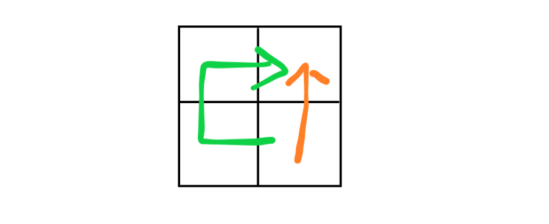
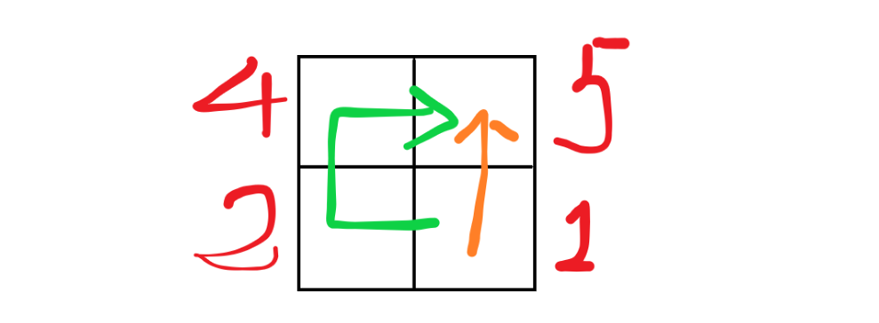

**`visited数组`一般在设计二维数组的题目使用BFS或者DFS算法，或者使用回溯算法时常用的一种辅助数据结构，是用作防止元素被重复访问导致程序处理时间变长或者数据栈溢出。但也不是只要碰到上述的几种类型题目就一定要用到`visited`数组，下面介绍几种判别是否使用的区分条件**

<!-- more -->

**<u>大前提：题目使用BFS, DFS, 回溯等算法</u>**

* 若题目不需要用元素之间的**联系**做题，也称作**路径无关**，则需要使用`visited`数组：什么叫没有联系呢，比如[200. 岛屿数量](https://leetcode-cn.com/problems/number-of-islands/)，我要从右下角用BFS或者DFS判断右上角那块是不是岛，我有两种方法，一种是通过橘色路线，另一种是通过绿色路线。但是问题是我采用这两条路线有什么差别吗？我反正就单纯想判断右上角那块是不是岛，假设我第一次通过橘色路线判断了右上角那块是岛，**虽然我还有一条路线，但我又何必再次通过绿色路线再判断一次这是不是块岛呢？**这就叫做没有联系，路径无关，右上和右下这两块不能通过路线这一特性进行联系，结果与路线不相关，不相关就是没联系。因此我们可以设置`visited[右上角] = true`，说明，**我已经访问过这位置的元素了，反正就是证明我是不是一块岛，现在已经证明完毕了，就别再通过其他乱七八糟的路线访问我啦。就算你还有10000000条不同的路径能到达这个位置那又如何？你还能通过不同路径一下会证明我是岛，一会证明我不是岛？客观现实不受主观意愿影响懂不懂？**。

  

* 若题目需要元素之间的**联系**做题，也称作**路径相关**，则一定不会使用`visited`数组：比如[329. 矩阵中的最长递增路径](https://leetcode-cn.com/problems/longest-increasing-path-in-a-matrix/)，我仍然还是从右下到右上，但是题目要求的是最长递增路径的长度。按照橘色路径走，最长路径为2；但是按照绿色路径走，最长路径就为3。虽然我第一次通过橘色走过了一条长为2的递增路径，但是我怎么知道我通过其他路劲不会走出一条更长的路呢。所以不能使用`visited`数组，我虽然已经访问过了右上角的元素，但是我不会阻碍它被之后的路径访问。这就叫元素之间有联系，也称路径相关，在此题中的联系为**谁更大**。

* 元素之间的联系有很多种，比如大小，异同等等