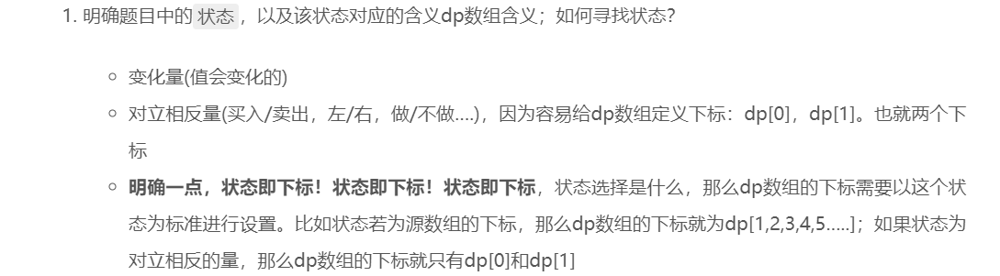
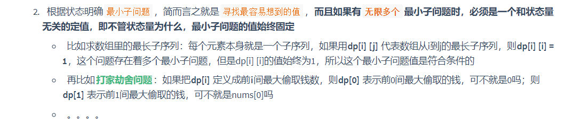
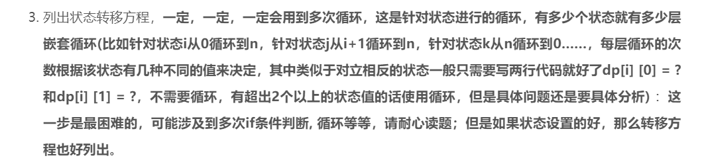

**详见[Leetcode98-验证二叉搜索树](E:\code\hexo-site\blog\source\_posts\Leetcode98-验证二叉搜索树.md)**

<!-- more -->

**这里再顺便简要说明一下递归函数的编写技巧，纯属个人做题时的总结，非严谨推导**

**随着做题的深入会不断更新~**

<u>**首先要明确起递归和动态规划之间的联系，递归是`自顶向下`，动态规划是`自底向上`，对于我个人来说，用[动态规划模板](./动态规划思想.md)格式化分析一道题要来的容易些，所以使用动态规划类比，构建其和递归之间的联系**</u>

### 一. 动态规划N步骤——>递归N步骤

**我们仿照动态规划里的说法对递归步骤进行定义**



1. 在使用递归的题目里，也涉及到状态，这个状态也能用**变化量**来确定，至于**对立相反量**目前还没看到
2. 如果动态规划里**状态即下标**，那么在递归方法里**状态就是递归函数某一次的递归**；动态规划的**dp数组下标**在递归里用**函数参数**替代，比如动态规划里的**`dp[5]`**在递归里用**`recursion(5)`**表示
3. 递归函数的意义和dp数组的意义的设置方法是相同的。比如`dp[2]`为前两个数组元素的和，那么`recursion(2)`也代表前两个数组元素的和。这个要具体问题具体分析，可能会很复杂
4. 这里需注意下，因为dp就是一个数组，最多根据状态个数拓展数组维度dp[a] [b] [c] [d]....；而根据函数的特性，可以有很多个参数，所以参数可以五花八门，其中跟具体题目逻辑无关的参数有
   1. 原始数组(如果题目给出的话)
   2. 根据题目分析出的状态变量
   3. ...

***



1. **递归里的`递归结束条件` == 动态规划里的`最小子问题`**，递归的递归结束条件也符合**最容易想到**原则
2. **动态规划里最小子问题必须要结合dp数组的含义才能确定，那么递归结束条件也必须要结合递归函数的定义才能确定**，我们举一个例子[Leetcode108. 将有序数组转换为二叉搜索树](./Leetcode108-将有序数组转换为二叉搜索树.md)，具体分析请移步对应题解页

***




1. 状态转移方程在动态规划里的体现就是**dp数组下标变化**，在递归里的体现就是**递归函数参数的变化**
2. 至于说动态规划里的有多少个状态就有多少次嵌套循环，在递归里貌似没有这种说法，TODO
3. 递归函数的参数也一般都是+1，-1或者具体问题具体分析

***


1. 递归最后返回的也是另一个极端

2. 递归的返回值是以函数的形式表示的，比如说`return recursion(n)`，它处在函数最外层；而动态规划的返回值是以值的形式返回的，比如说`return dp[n]`，他处在函数内层的最下面；这是特指有返回值的情况，若无返回值，比如说输出一组最xxx的路径等返回值为`void`类型数据的情况时，两者无区别，都是把最终的值保存在一个第三方的容器里。

   ```c++
   int function(){
     // 函数内层的最下面
     return dp[n];
   }
   
   // 函数最外层
   int recursion(int n){
     return variable;
   }
   ```

   ```c++
   // 特例，两者无区别
   vector<int> path;
   
   void function(){
     // 函数内层的最下面
     path.push_back(n);
   }
   
   // 函数最外层
   void recursion(int n){
     path.push_back(n);
   }
   ```

### 二、最后给出一个公式

1. 状态：A ，B，C....，N个状态的组合对应着什么值

2. 递归终止条件：dp[i] = ... 或者 dp[i] [0] = .....或者其他

   **用动态规划的角度表示最小子问题为：**

3. 状态转移方程(可能涉及到多次if条件判断)：recursion(i) = recursion(i + 1) + x 或其他

   **用动态规划的角度表示转移方程为：**

4. 返回最终状态：return recursion(n)；或者其他

   **用动态规划的角度表示最终返回值为：**