**转载自：[CSDN（老阳07），略有增删](https://blog.csdn.net/wangdy0707/article/details/103241915)**

<!-- more -->

#### 〇、初始化图

**虽然图算法重要，但是对图的构造也是成功的第一步，在Leetcode刷题的时候一般需要对已知条件通过邻接表或者邻接矩阵的形式构造图，然后才在此基础上进行各式各样的算法。这里先介绍几种类型的构造方式，以后做跟图相关的题目时直接照抄即可**

1. **无向无权图**的**邻接表**构造

   ```java
   // 给出条件    输入：edges = [ [1,2], [2,3], [3,4], [1, 3] ], V = 4, E = 4
   Map<Integer, LinkedList<Integer>> graph = new HashMap();
   
   for(int[] edge : edges){
     if (!graph.containsKey(edge[0])){
       graph.put(edge[0], new ArrayList<Integer>());
     }
     if(!graph.containsKey(edge[1])){
       graph.put(edge[1], new ArrayList<Integer>());
     }
     graph.get(edge[0]).add(edge[1]);
     graph.get(edge[1]).add(edge[0]);
   }
   ```

2. **无向无权图**的**邻接矩阵**构造

   ```java
   // 给出条件    输入：edges = [ [1,2], [2,3], [3,4], [1, 3] ], V = 4, E = 4
   int[][] graph = new int[V][V];
   
   for(int[] edge : edges){
     graph[edge[0]][edge[1]] = 1;
     graph[edge[1]][edge[0]] = 1;
   }
   ```

   

#### 一、广度优先搜索（BFS）

[BFS问题模板](./BFS问题模板.md)

#### 二、深度优先搜索（DFS）

[分而治之和递归的区别](./分而治之和递归的区别.md)

**图和一般二维数组的DFS在形式是有些许不同，沿用〇、1. 无向无权图的邻接表构造**

```java
public main void(String[] args){
  // 新建图结构.....
  
  boolean[] visited = new boolean[V];
  ArrayList<Integer> order = new ArrayList<>();
  dfs("key值", visited, order);
}

void dfs(int v, boolean[] visited, ArrayList<Integer> order) {
  visited[v] = true;
  order.add(v);
  for (int w : graph.get(v))
    if (!visited[w])
      dfs(w);
}
```

##### 2.1 图的联通分量个数

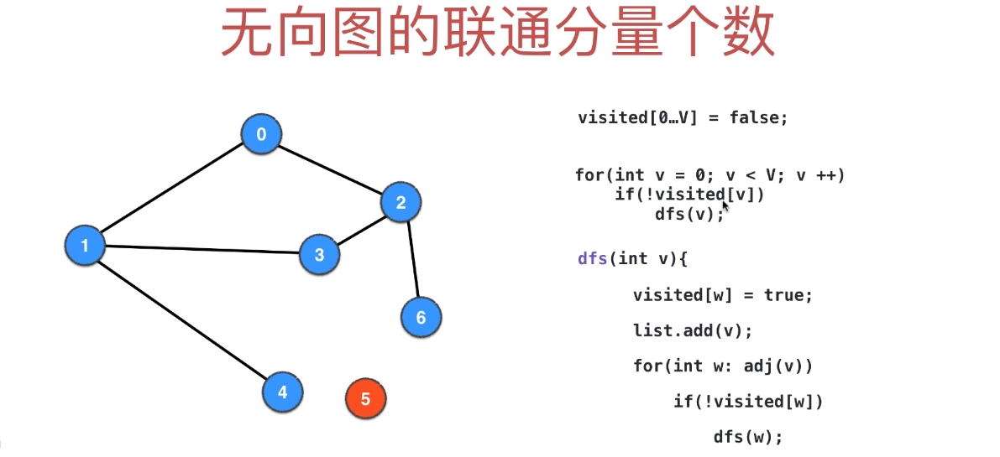

```java
int getCount(){
  // 新建图结构.....
  
  int count = 0;
  boolean[] visited = new boolean[V];

  for(int v : graph.keySet()){
    if (!visited[v]) {
      dfs(v, visited);
      count++;
    }
  }
  return count;
}

void dfs(int v, boolean[] visited) {
  visited[v] = true;

  for (int w : graph.get(v))
    if (!visited[w])
      dfs(w);
}
```

##### 2.2 单源最短路径问题

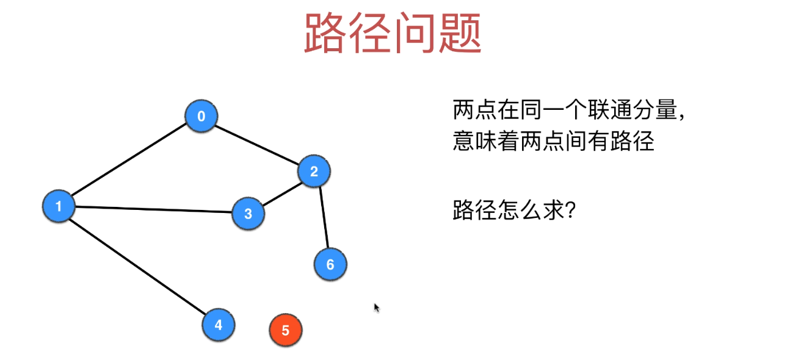

***

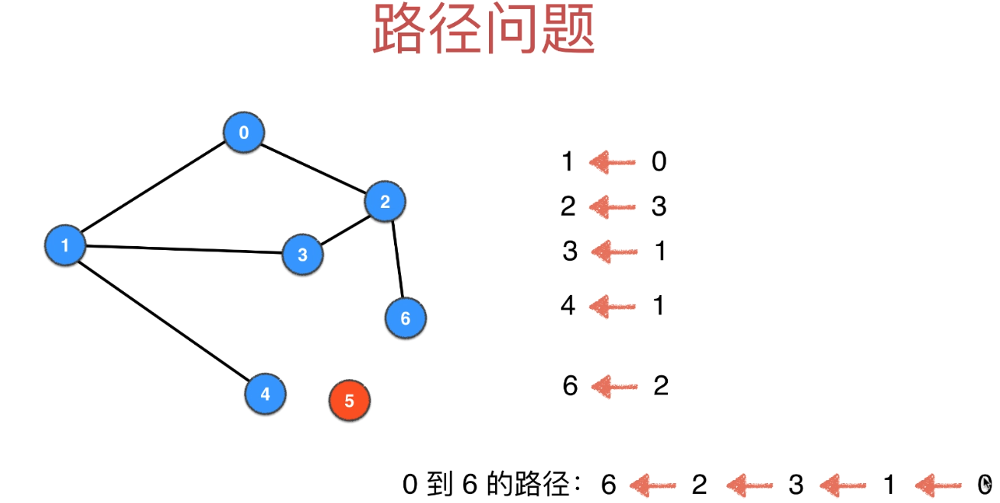

```java
// 以s为起点，记录从s到图中其他
public void SingleSourcePath(int s) {
  // 新建图结构.....
  
  boolean[] visited = new boolean[V];
  // 记录前驱节点
  int[] pre = new int[V];
  
  dfs(0, 0);
}

void dfs(int v, int parent){
  visited[v] = true;
  pre[v] = parent;
  for (int w : graph.get(v))
    if (!visited[w])
      dfs(w, v);
}

// 判断t节点是否与源节点联通
public boolean isConnectedTo(int t) {
  return visited[t];
}

// 获取从源节点到t节点的路径
public ArrayList<Integer> path(int s, int t) {
  
  ArrayList<Integer> res = new ArrayList<Integer>();
  if (!isConnectedTo(t))
    return res;

  int cur = t;
  while (cur != s) {
    res.add(cur);
    cur = pre[cur];
  }
  res.add(s);

  Collections.reverse(res);
  return res;
}


// 调用方法, 以0为原点，生成图的前缀列表
// 以上图为例：图的前缀列表为[0, 0, 3, 1, 1, 2]
SingleSourcePath(0);
// 0->4的路径
path(0, 4);
// 0->6的路径
path(0, 6);
```

##### 2.3  单源最短路径问题优化(剪枝)

```java
// 找到目标路径就停止递归
boolean dfs(int v, int parent) {

  visited[v] = true;
  pre[v] = parent;
	// t是目标节点
  if (v == t)
    return true;

  for (int w : graph.get(v))
    if (!visited[w])
      if (dfs(w, v))
        return true;
  return false;
}
```

##### 2.4 无向图的环检测

其实就是看有没有一条自己到自己的路径

```java
// 以s为起点，记录从s到图中其他
public boolean CycleDetection(int s) {
  // 新建图结构.....
  
  boolean[] visited = new boolean[V];
  for (int i = 0; i < V; i++)
    if (!visited[i])
      if (dfs(i, i)) {
        hasCycle = true;
        break;
      }
  return hasCycle;
}

boolean dfs(int v, int parent){
  visited[v] = true;
  for (int w : graph.get(v))
    // 访问过并且不是上一个节点则表明出现环
    if (!visited[w]) {
      if (dfs(w, v))
        return true;
    } else if (w != parent)
      return true;
  return false;
}
```

##### 2.5 二分图检测

1. 相亲网站，左边是男士，右边是女士
2. 选课，左边是学生，右边是课程
3. ......

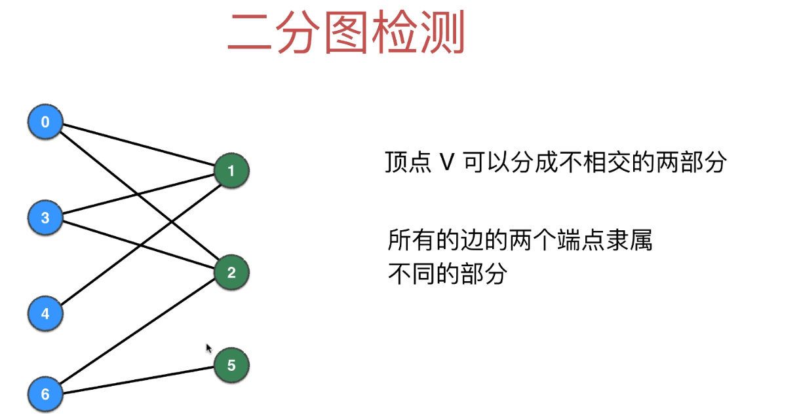


**不要以为看了上图就以为二分图能很容易看出来，其实如下图所示，右边的图其实就是左边的图，那你能看出来右边的图是二分图吗？**

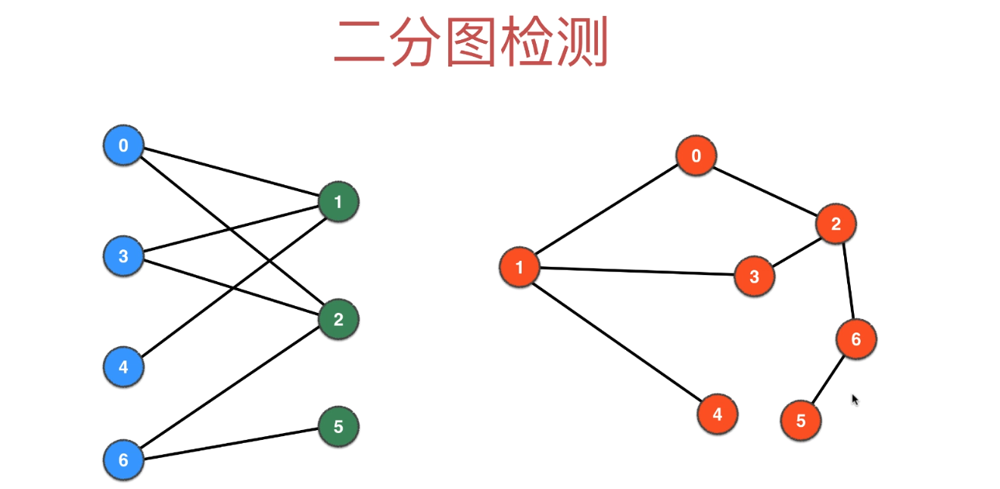

**正因为二分图无法简单地判断出来，所以我们需要一种算法帮我们判定，这种算法称之为：染色。染色就是说在DFS遍历图的过程中对节点进行赋值，比如我们用蓝色和绿色去染色，看看在DFS结束后，图中的任意一条边是否能一遍连接蓝色点，一边连接绿色点**

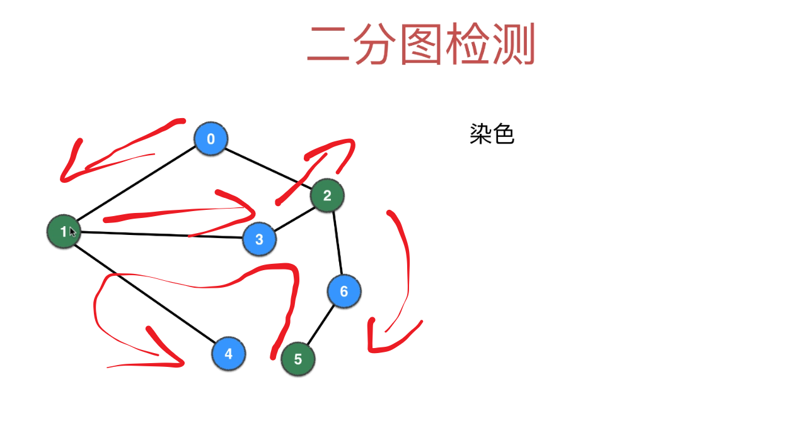

```java
public boolean BipartitionDetection(Graph G){
  // 新建图结构.....
  
  boolean[] visited = new boolean[V];
  int[] colors = new int[V];
  boolean isBipartite = true;
  for(int i = 0; i < V; i ++){
    // 表示所有节点都没染色
    colors[i] = -1;
  }

  for(int i = 0; i < V; i++){
    if(!visited[i]){
      if(!dfs(i, 0)){
        isBipartite = false;
        break;
      }
    }
  }
  return isBipartite;
}

// 若是二分图则返回true
boolean dfs(int v, int color){

  visited[v] = true;
  colors[v] = color;
  for(int w: graph.get(v)){
    if(!visited[w]){
      // 1 - color: 若当前节点颜色为0，则下一节点颜色为1; 若当前节点颜色为1，则下一节点颜色为0
      if(!dfs(w, 1 - color)) return false;
    } else if(colors[w] == colors[v]){
      // v,w 两端颜色相同
      return false;
    }
  }
  return true;
}
```

#### 三、拓扑排序（TurboSort），基本等同于广度优先遍历

拓扑排序主要是针对有向无环图的算法，定义是：通过该算法得出一个序列，使得有向无环图（DAG）中的任意一对顶点若存在边<u,v>，则在拓扑排序得到的线性序列中，顶点u一定出现在顶点v之前，即保证依赖关系的顺序性。

可能这么描述稍微有一点学术，什么意思呢，通俗上讲就是我们要解决依赖关系，比如你想要一个孙子，怎么办？首先，你要有一个儿子，儿子哪里来，得自己生啊，怎么生呢？你要结婚啊！跟谁结婚呢？你要先有个对象啊！有对象就能结婚了么？不，你没车没房没彩礼，你丈母娘不能同意啊！所以，要想达到某一个节点，你需要先搞定其中的必要条件，当然，这些必要条件对于同一个节点的入度节点是不要求顺序的，比如你先买车还是先买房，你丈母娘都是能同意的，但是你都得买，你必须把你丈母娘的入度减到零，才能搞定丈母娘！所以这个Case的拓扑排序如下图：

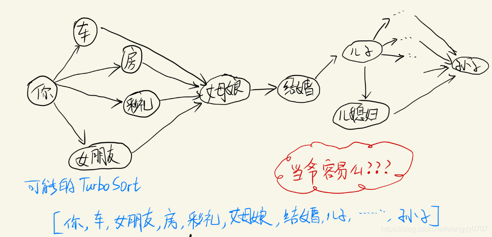

 如上，拓扑排序就是在各种依赖关系中找出一些合理的线性关系来满足各种依赖，例如我们大学上课，选课时某些课程存在前驱课程，如统计学习的前驱课程有高数，现代等，没有相关基础，我们没办法学好这些高等课程。下面例题我将会介绍LeetCode上一道这样的拓扑排序题目。类似的还有项目工程关系，多个项目之间也存在依赖的先后次序。

**下面的图片给出了广度优先搜索的可视化流程，来自[力扣官方题解](https://leetcode-cn.com/problems/course-schedule-ii/solution/ke-cheng-biao-ii-by-leetcode-solution/)**

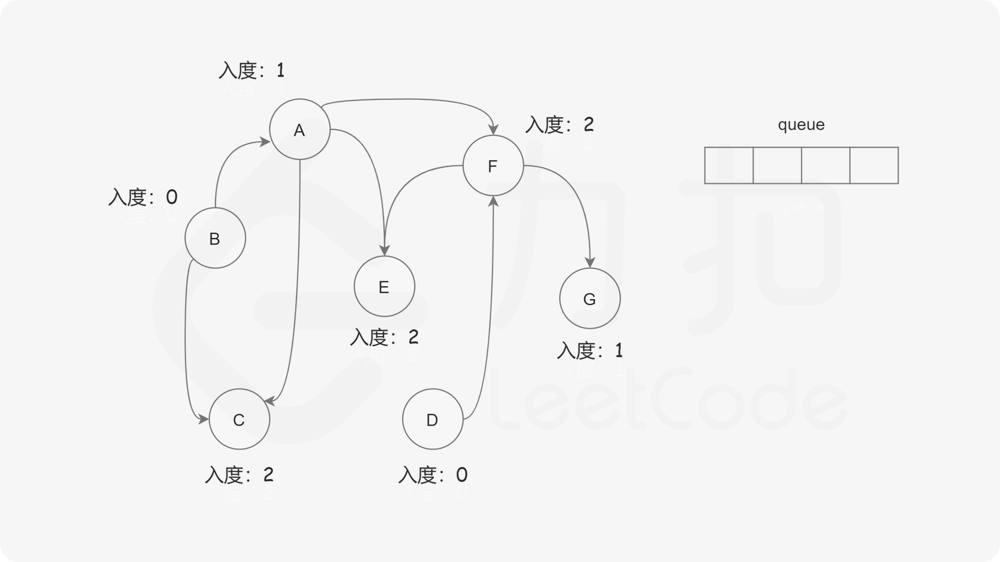

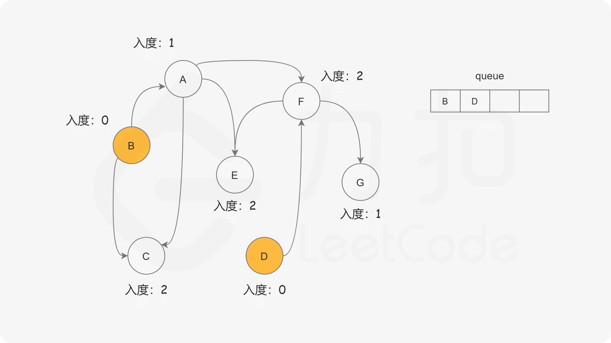

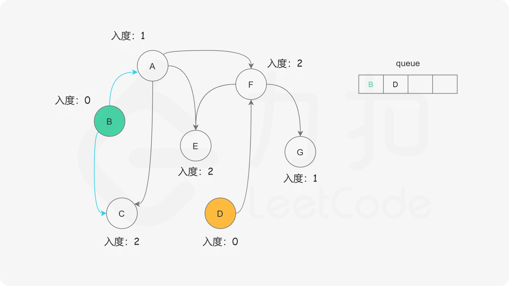

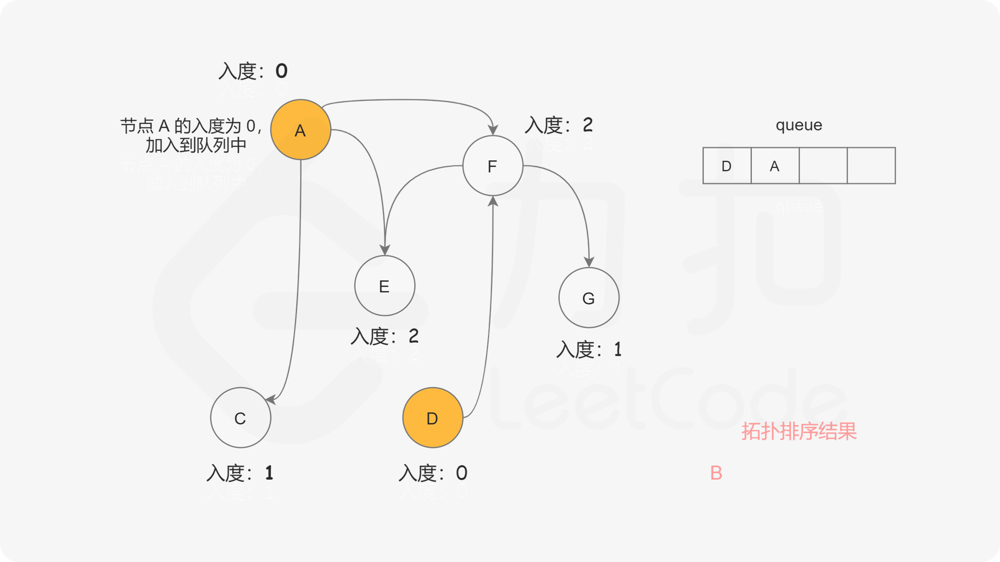

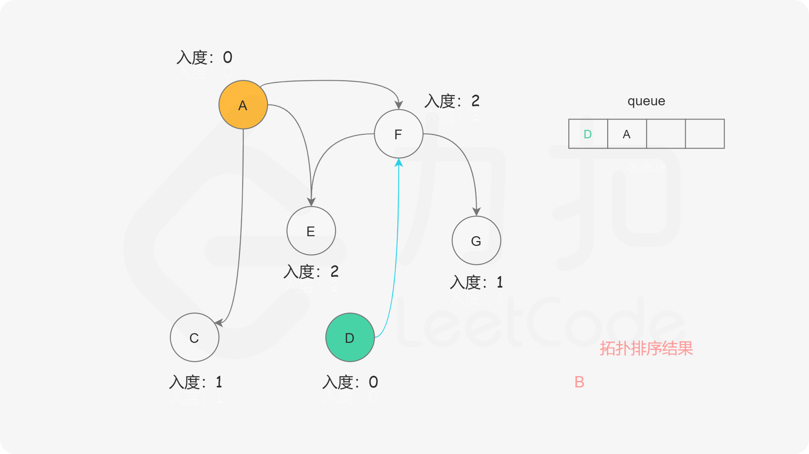

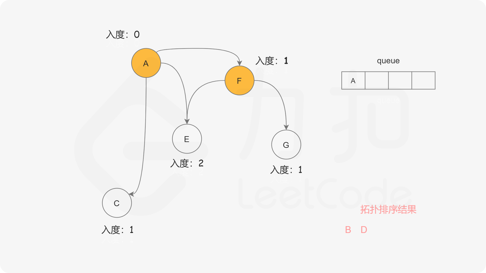

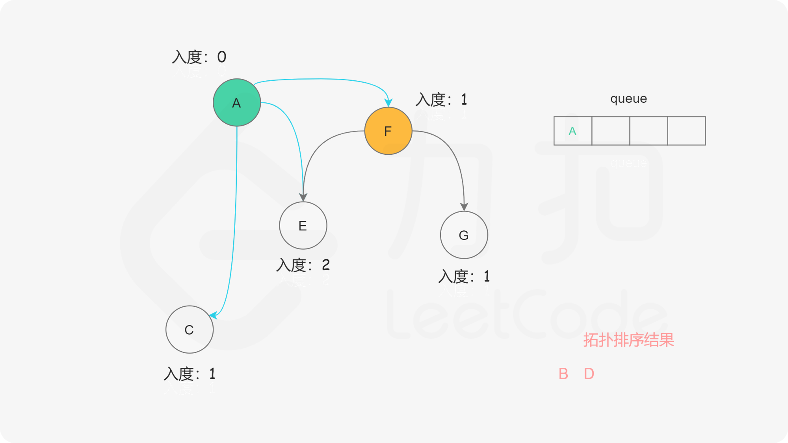

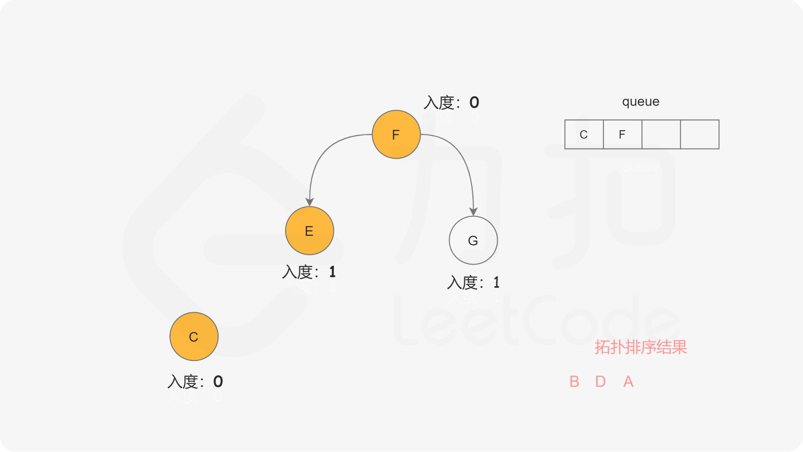

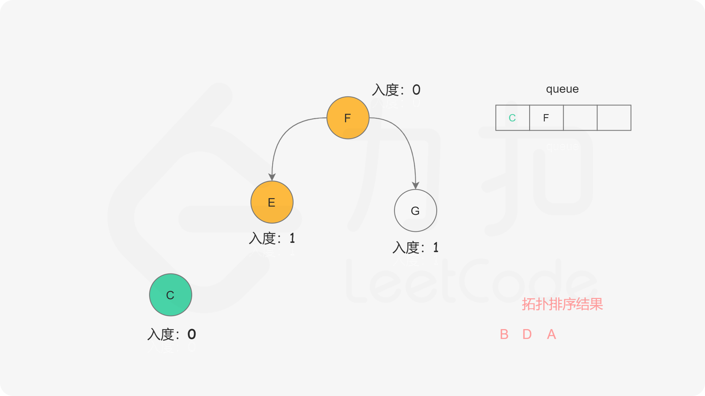

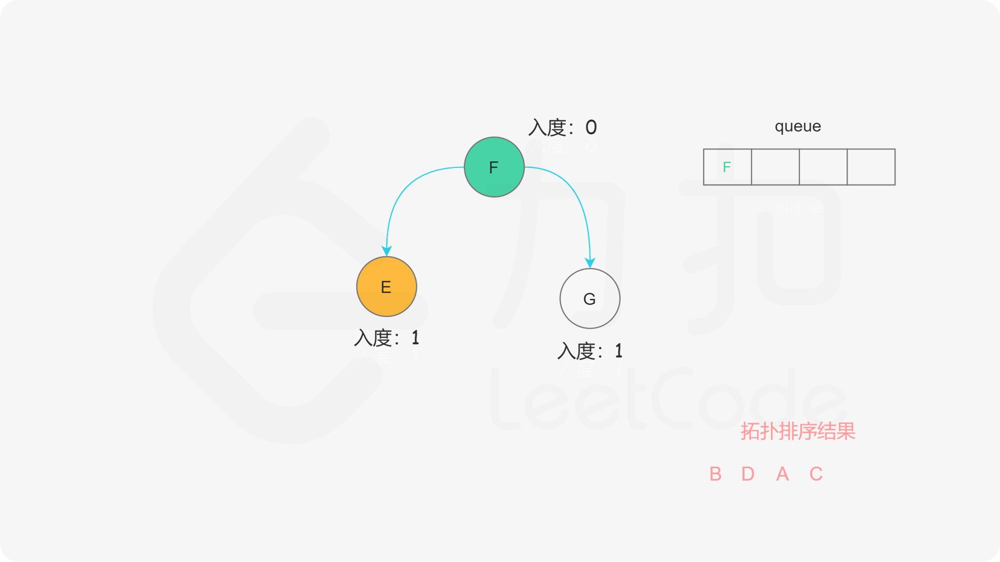


值得注意的是，拓扑排序不能应用于有环图，因为我们的前提条件是总能至少在图中找到一个入度为0的顶点开始拓扑，但是当图中存在环时，我们在这个环中找不到任意一个入度为0顶的点。

之前介绍拓扑排序是利用的广度优先的思想，也是借助队列这个辅助数据结构、之前在**BFS问题模板里也有说明**，把图中所有度为1的节点先入队

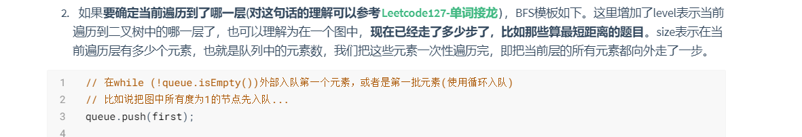

具体的算法流程是：

1. 首先建立一个countArr数组并统计每一个顶点的入度填到对应数组中；通过遍历，首先将所有入度为0的节点入队，并将节点总数vexCount相应减少。
2. 然后利用广度优先搜索的思路进行循环，里面注意的操作是：每当出队一个顶点时，我们将以该顶点为弧尾的弧顶顶点对应的入度countArr[i]减一，并判断该countArr[i]是否为0，为零则将该元素入队，并将vexCount减一，循环直至队列为空。
3. 就这样一层一层向内剥洋葱，最后判断vexCount是否为0，如果为0，说明我们洋葱剥成功，如果不为零，则说明这个洋葱有心儿，即成环了，无法彻底剥开。最后输出的顶点出队顺序就是该图对应的一个拓扑序列。

**这里额外考虑一点，使用[visited数组的使用方法](./visited数组的使用方法.md)判断拓扑排序算法是否需要使用visited辅助**，观察下图分析从A到D有两条路径A->D 和 A->B->C->D，当先通过A->D这条路线到达D之后不能把visited[D]设为true，因为之后还有一条路线A-->B->C->D还需要被考虑到。所以拓扑排序是和路径相关的，所以不能设置`visited`数组

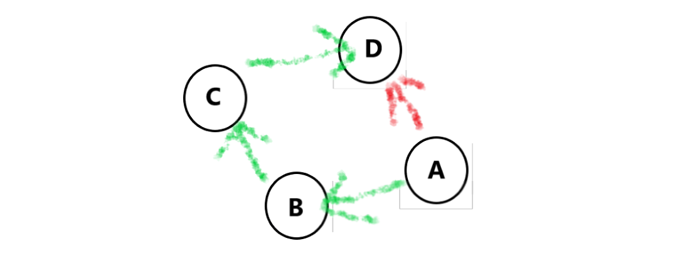

下面以LeetCode的[Leetcode210. 课程表 II](https://leetcode-cn.com/problems/course-schedule-ii/)进行介绍：

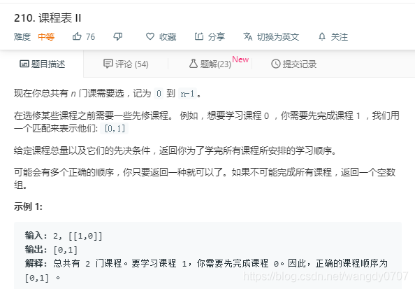

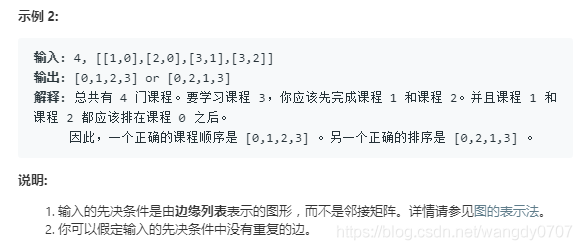

这一题就是典型的拓扑排序，没有别的套路，拓扑排序直接上，这题较为简单，没有对拓扑排序的线性序列进行过多的要求，返回一个正确的序列即可。对于较为难的题我们需要对顶点出队的顺序进行控制，或者进行二次的拓扑排序，以满足题目对输入序列额外的要求，如LeetCode的[Leetcode1203. 项目管理](https://leetcode-cn.com/problems/sort-items-by-groups-respecting-dependencies/)

**建图方法详见和BFS问题模板详见[BFS问题模板](./BFS问题模板.md)**

```c++
class Solution {
private:
    // 存储有向图
    vector<vector<int>> edges;
    // 存储每个节点的入度
    vector<int> indeg;
    // 存储答案
    vector<int> result;

public:
    vector<int> findOrder(int numCourses, vector<vector<int>>& prerequisites) {
        edges.resize(numCourses);	
        indeg.resize(numCourses);
        for (const auto& info: prerequisites) {
            edges[info[1]].push_back(info[0]);
            ++indeg[info[0]];
        }

        queue<int> q;
        // 将所有入度为 0 的节点放入队列中
        for (int i = 0; i < numCourses; ++i) {
            if (indeg[i] == 0) {
                q.push(i);
            }
        }

        while (!q.empty()) {
            // 从队首取出一个节点
            int u = q.front();
            q.pop();
            // 放入答案中
            result.push_back(u);
            for (int v: edges[u]) {
                --indeg[v];
                // 如果相邻节点 v 的入度为 0，就可以选 v 对应的课程了
                if (indeg[v] == 0) {
                    q.push(v);
                }
            }
        }

        if (result.size() != numCourses) {
            return {};
        }
        return result;
    }
};
```

##### 3.1 拓扑排序也可以用来判定图是否有环路

**只需要在`Leetcode210. 课程表 II`里修改一点点点点代码即可：用visited计数**

**这题对应[Leetcode207. 课程表](https://leetcode-cn.com/problems/course-schedule/)**

```c++
class Solution {
private:
    vector<vector<int>> edges;
    vector<int> indeg;

public:
    bool canFinish(int numCourses, vector<vector<int>>& prerequisites) {
        edges.resize(numCourses);
        indeg.resize(numCourses);
        for (const auto& info: prerequisites) {
            edges[info[1]].push_back(info[0]);
            ++indeg[info[0]];
        }

        queue<int> q;
        for (int i = 0; i < numCourses; ++i) {
            if (indeg[i] == 0) {
                q.push(i);
            }
        }

        int visited = 0; 	// 添加visited计数器
        while (!q.empty()) {
            ++visited;
            int u = q.front();
            q.pop();
            for (int v: edges[u]) {
                --indeg[v];
                if (indeg[v] == 0) {
                    q.push(v);
                }
            }
        }

        return visited == numCourses;		// 判断计数器结果是否等于所有课程数
    }
};
```

