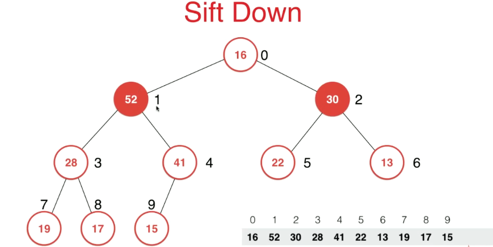
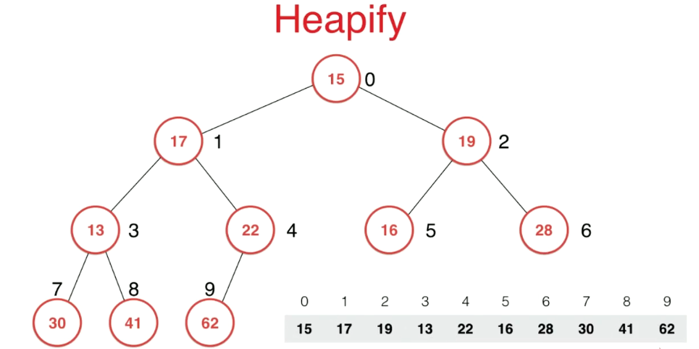

**堆Heap，俗称优先队列priority queue。在做题时绝大部分都是用来求一串序列中的最大最小值的**

#### 一、堆的基础表示

1. **一个堆就是一棵树用数组表示的完全二叉树**
2. **堆中某个节点的值总是不大于(小于)其父节点的值，对应叫法为大根堆，小根堆**

用数组存放堆，每个堆元素对应的数组下标为，下面一幅图是以初始元素的下标为0制定的


#### 二、向堆中添加元素和Sift Up

我们向二叉堆添加一个元素，对于用数组构建的堆来说，就相当于在数组末尾添加一个元素


***


***

若二叉堆为大根堆时，当添加进一个元素之后，若新增元素比它父亲节点要大，则打破了大根堆的性质，所以要对其重新**大根堆化**，即交换父亲和孩子节点值。在数组中的体现就是原来下标的数值交换，并且把当前要处理的堆节点变为父节点


同理不断地对堆元素进行Sift Up，直到当前处理元素下标为0或者父亲节点值大于孩子结点值


***


```c++
// 表示对堆里的第几个元素进行siftUp操作
// 调用格式：siftUp(data.size() - 1); 即对堆的最后一个元素进行siftUp操作
void siftUp(int k){
  // 当前节点下标>0 且 父亲节点值大于当前节点值
	while(k > 0 && data[parent(k)] < data[k]){
    swap(k, parent(k));
    k = parent(k);
  }
}

int parent(int k){
  return data[(k - 1) / 2];
}

void swap(int i, int j){
  int t;
  t = data[i];
  data[i] = data[j];
  data[j] = t;
}
```

#### 三、取出堆中的最大元素和Sift Down

我们之所以称一个堆为最大堆，是因为我们取出操作只能取堆顶的元素，也就是大根堆里最大的元素，不能取出其他元素。


***

我们取出堆顶元素，就是把堆顶元素删除然后把堆末尾元素放到堆顶


同时把最后一个元素删除掉，那么首先从元素个数来看，我们成功减少了一个元素，并且我们真正减少的就是原来二叉堆堆顶的那个元素。但是此时堆顶的元素打破了原来大根堆的性质，所以我们需要把堆顶元素往下调整


选择当前节点孩子节点中值最大的那个元素节点，如果孩子节点的最大值要比当前节点值还要大的话就把两者交换位置



***


同理沿着节点一直交换下去


***

直到当前节点值大于左右孩子节点值或者为叶子结点


***


```java
// 取出堆顶元素，并且保持大/小根堆的性质
int extractMax(){
  int max = data[0];

  swap(0, data.size() - 1);
  // len 值数组长度
  len = data.size() - 1;
  siftDown(0);

  return max;
}

void swap(int i, int j){
  int t;
  t = data[i];
  data[i] = data[j];
  data[j] = t;
}

// 表示对堆里的第几个元素进行siftDown操作
void siftDown(int k){
  // 左孩子节点下标不能大于数组长度
  while(leftChild(k) < data.size()){
    int j = leftChild(k);
    // 要么是左孩子最大，要么是右孩子最大，选一个跟当前节点交换位置
    if(j + 1 < data.size() && data[j + 1] > data[j]){
      j++;
    }
    if(data[k] >= data[j]){
      break;
    }
    swap(k, j);
    // 不断下沉
    k = j;
  }
}

int leftChild(int k){
  return 2 * k + 1;
}

int rightChild(int k){
  return 2 * k + 2;
}
```

#### 四、Heapify(将数任意数组整理成堆的形状)

**使用之前的Sift Down和Sift Up操作**

一个任意的数组用二叉堆的形式表示：元素组为[15, 17, 19, 13, 22, 16, 28, 30, 41, 62]，但是它不符合大根堆或者小根堆的性质



**从最后一个非叶子结点开始计算**，不断从右到左，从下到上的进行Sift Down操作即可，**最后一个非叶子结点对应数组下标为最后一个节点的父节点的下标**


***


同理


***


***


***


```c++
void heapify(int[] data){
  for(int i = parent(data.size() - 1); i >= 0; i--){
    siftDown(i);
  }
}

int parent(int k){
  return (k - 1) / 2;
}
```

