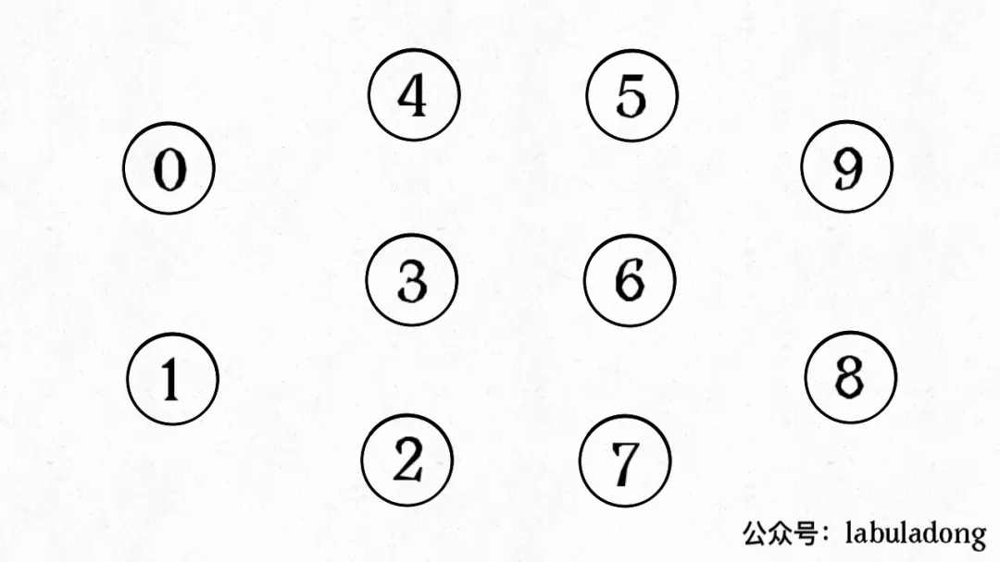
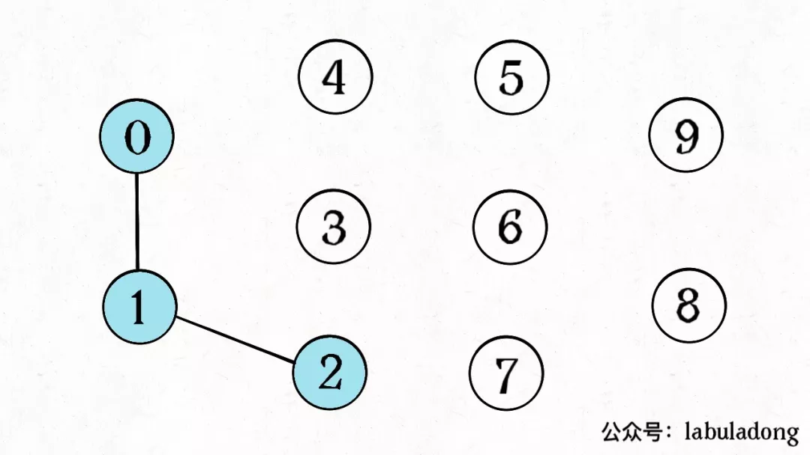
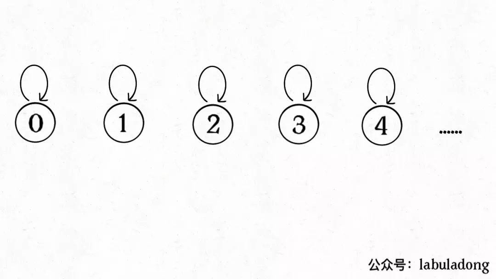
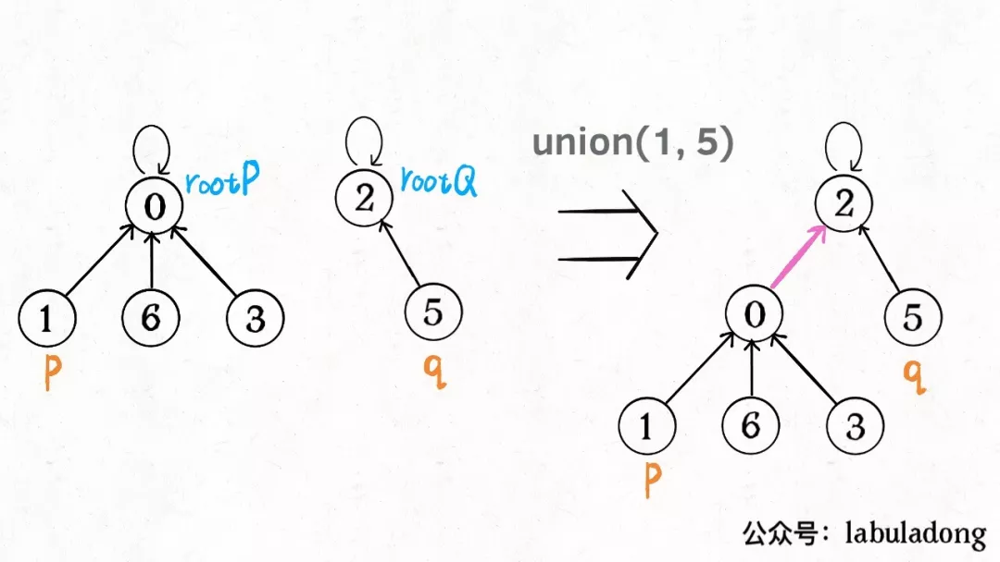
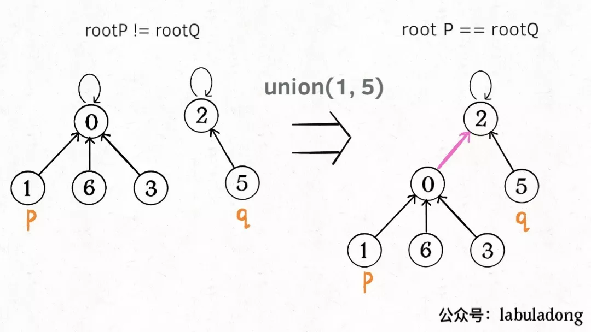
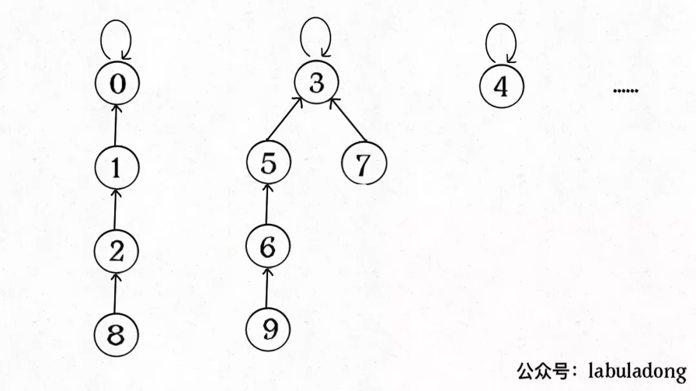
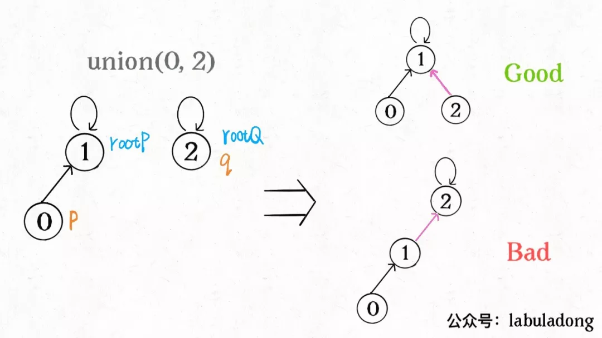

**转载自：[公众号（labuladong），略有增删](https://mp.weixin.qq.com/s/gUwLfi25TYamq8AJVIopfA)**

<!-- more -->

### 1. 问题介绍

简单说，动态连通性其实可以抽象成给一幅图连线。比如下面这幅图，总共有 10 个节点，他们互不相连，分别用 0~9 标记：



现在我们的 并查(Union-Find) 算法主要需要实现这两个 API：

```java
class UF {
    /* 将 p 和 q 连接 */
    public void union(int p, int q);
    /* 判断 p 和 q 是否连通 */
    public boolean connected(int p, int q);
    /* 返回图中有多少个连通分量 */
    public int count();
}
```

这里所说的「连通」是一种等价关系，也就是说具有如下三个性质：

**1、自反性**：节点`p`和`p`是连通的。

**2、对称性**：如果节点`p`和`q`连通，那么`q`和`p`也连通。

**3、传递性**：如果节点`p`和`q`连通，`q`和`r`连通，那么`p`和`r`也连通。

比如说之前那幅图，0～9 任意两个**不同**的点都不连通，调用`connected`都会返回 false，连通分量为 10 个。

如果现在调用`union(0, 1)`，那么 0 和 1 被连通，连通分量降为 9 个。

再调用`union(1, 2)`，这时 0,1,2 都被连通，调用`connected(0, 2)`也会返回 true，连通分量变为 8 个。



判断这种「等价关系」非常实用，比如说编译器判断同一个变量的不同引用，比如社交网络中的朋友圈计算等等。

### 2. 基本思路

那么用什么模型来表示这幅图的连通状态呢？用什么数据结构来实现代码呢？

我们使用森林（若干棵树）来表示图的动态连通性，用数组来具体实现这个森林。怎么用森林来表示连通性呢？我们设定树的每个节点有一个指针指向其父节点，如果是根节点的话，这个指针指向自己。

比如说刚才那幅 10 个节点的图，一开始的时候没有相互连通，就是这样：

```java
class UF {
    // 记录连通分量
    private int count;
    // 节点 x 的节点是 parent[x]
    private int[] parent;

    /* 构造函数，n 为图的节点总数 */
    public UF(int n) {
        // 一开始互不连通
        this.count = n;
        // 父节点指针初始指向自己
        parent = new int[n];
        for (int i = 0; i < n; i++)
            parent[i] = i;
    }

    /* 其他函数 */
}
```



```java
public void union(int p, int q) {
    int rootP = find(p);
    int rootQ = find(q);
    if (rootP == rootQ)
        return;
    // 将两棵树合并为一棵
    parent[rootP] = rootQ;
    // parent[rootQ] = rootP 也一样
    count--; // 两个分量合二为一
}

/* 返回某个节点 x 的根节点 */
private int find(int x) {
    // 根节点的 parent[x] == x
    while (parent[x] != x)
        x = parent[x];
    return x;
}

/* 返回当前的连通分量个数 */
public int count() { 
    return count;
}
```



**这样，如果节点p和q连通的话，它们一定拥有相同的根节点**：

```java
public boolean connected(int p, int q) {
    int rootP = find(p);
    int rootQ = find(q);
    return rootP == rootQ;
}
```



至此，Union-Find 算法就基本完成了。是不是很神奇？竟然可以这样使用数组来模拟出一个森林，如此巧妙的解决这个比较复杂的问题！

那么这个算法的复杂度是多少呢？我们发现，主要 API`connected`和`union`中的复杂度都是`find`函数造成的，所以说它们的复杂度和`find`一样。

`find`主要功能就是从某个节点向上遍历到树根，其时间复杂度就是树的高度。我们可能习惯性地认为树的高度就是`logN`，但这并不一定。**logN的高度只存在于平衡二叉树，对于一般的树可能出现极端不平衡的情况，使得「树」几乎退化成「链表」，树的高度最坏情况下可能变成N。**



所以说上面这种解法，`find`,`union`,`connected`的时间复杂度都是 O(N)。这个复杂度很不理想的，你想图论解决的都是诸如社交网络这样数据规模巨大的问题，对于`union`和`connected`的调用非常频繁，每次调用需要线性时间完全不可忍受。

### 3. 平衡性优化

我们要知道哪种情况下可能出现不平衡现象，关键在于`union`过程：

```java
public void union(int p, int q) {
    int rootP = find(p);
    int rootQ = find(q);
    if (rootP == rootQ)
        return;
    // 将两棵树合并为一棵
    parent[rootP] = rootQ;
    // parent[rootQ] = rootP 也可以
    count--; 
}
```

我们一开始就是简单粗暴的把`p`所在的树接到`q`所在的树的根节点下面，那么这里就可能出现「头重脚轻」的不平衡状况，比如下面这种局面：



长此以往，树可能生长得很不平衡。**我们其实是希望，小一些的树接到大一些的树下面，这样就能避免头重脚轻，更平衡一些**。解决方法是额外使用一个`size`数组，记录每棵树包含的节点数，我们不妨称为「重量」：

```java
class UF {
    private int count;
    private int[] parent;
    // 新增一个数组记录树的“重量”
    private int[] size;

    public UF(int n) {
        this.count = n;
        parent = new int[n];
        // 最初每棵树只有一个节点
        // 重量应该初始化 1
        size = new int[n];
        for (int i = 0; i < n; i++) {
            parent[i] = i;
            size[i] = 1;
        }
    }
    /* 其他函数 */
}
```

比如说`size[3] = 5`表示，以节点`3`为根的那棵树，总共有`5`个节点。这样我们可以修改一下`union`方法：

```java
public void union(int p, int q) {
    int rootP = find(p);
    int rootQ = find(q);
    if (rootP == rootQ)
        return;

    // 小树接到大树下面，较平衡
    if (size[rootP] > size[rootQ]) {
        parent[rootQ] = rootP;
        size[rootP] += size[rootQ];
    } else {
        parent[rootP] = rootQ;
        size[rootQ] += size[rootP];
    }
    count--;
}
```

这样，通过比较树的重量，就可以保证树的生长相对平衡，树的高度大致在`logN`这个数量级，极大提升执行效率。

此时，`find`,`union`,`connected`的时间复杂度都下降为 O(logN)，即便数据规模上亿，所需时间也非常少。

### 4. 路径压缩(如果想不明白可以不用，问题也不大)

这步优化特别简单，所以非常巧妙。我们能不能进一步压缩每棵树的高度，使树高始终保持为常数？

这样`find`就能以 O(1) 的时间找到某一节点的根节点，相应的，`connected`和`union`复杂度都下降为 O(1)。

要做到这一点，非常简单，只需要在`find`中加一行代码：

```java
private int find(int x) {
    while (parent[x] != x) {
        // 进行路径压缩
        parent[x] = parent[parent[x]];
        x = parent[x];
    }
    return x;
}
```

**动图演示移步[公众号（labuladong）](https://mp.weixin.qq.com/s/gUwLfi25TYamq8AJVIopfA)**

### 5. 最后总结

```java
class UF {
    // 连通分量个数
    private int count;
    // 存储一棵树
    private int[] parent;
    // 记录树的“重量”
    private int[] size;

    public UF(int n) {
        this.count = n;
        parent = new int[n];
        size = new int[n];
        for (int i = 0; i < n; i++) {
            parent[i] = i;
            size[i] = 1;
        }
    }

    public void union(int p, int q) {
        int rootP = find(p);
        int rootQ = find(q);
        if (rootP == rootQ)
            return;

        // 小树接到大树下面，较平衡
        if (size[rootP] > size[rootQ]) {
            parent[rootQ] = rootP;
            size[rootP] += size[rootQ];
        } else {
            parent[rootP] = rootQ;
            size[rootQ] += size[rootP];
        }
        count--;
    }

    public boolean connected(int p, int q) {
        int rootP = find(p);
        int rootQ = find(q);
        return rootP == rootQ;
    }

  	// 这里的find是采用了路径压缩之后的写法
  	// 如果不采用路径压缩则可以直接写一行代码：x = parent[x];
    private int find(int x) {
        while (parent[x] != x) {
            // 进行路径压缩
            parent[x] = parent[parent[x]];
            x = parent[x];
        }
        return x;
    }
}
```

Union-Find 算法的复杂度可以这样分析：构造函数初始化数据结构需要 O(N) 的时间和空间复杂度；连通两个节点`union`、判断两个节点的连通性`connected`、计算连通分量`count`所需的时间复杂度均为 O(1)。